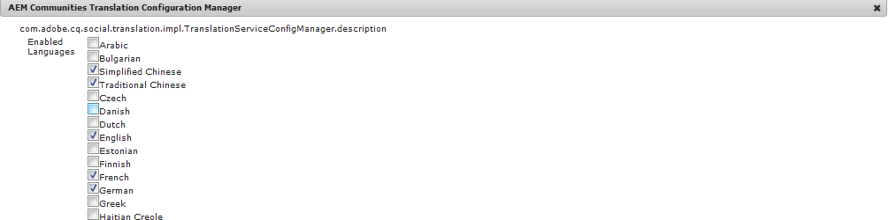

# Translating User Generated Content{#translating-user-generated-content}

The translation feature for AEM Communities extends the concept of [translating page content](../../sites/administering/using/translation.md) to the user generated content (UGC) posted to community sites using [social component framework (SCF) components](../../communities/using/scf.md).

The translation of UGC enables site visitors and members to experience a global community by removing language barriers.

As an example, suppose

* a member from France posts a recipe in French to the community forum of a multinational cooking website
* another member from Japan uses the translation feature to trigger the translation of the recipe from French into Japanese
* after reading the recipe in Japanese, the member from Japan then posts a comment in Japanese
* the member from France uses the translation feature to translate the Japanese comment into French
* global communication!

## Overview {#overview}

This seciton of the documentation specifically discusses how the translation service works with UGC while assuming an understanding of how to connect AEM to a [translation service provider](../../sites/administering/using/translation.md#connectingtoatranslationserviceprovider) and integrate that service into a website by configuring a [translation integration framework](../../sites/administering/using/tc-tic.md).

When a translation service provider is associated with the site, each language copy of the site maintains its own threads of UGC posted through SCF components such as comments.

When a translation integration framework is configured in addition to the translation service provider, it is possible for each language copy of the site to share a single thread of UGC, thus providing global communication across language copies. Instead of a discussion thread segregated by language, the configured [global shared store](#globaltranslationofugc) enables the entire thread to be visible regardless from which language copy it is being viewed. Further, multiple translation integration configurations can be configured specifying different global shared stores for a logical grouping of global participants, such as by regions.

## The Default Translation Service {#the-default-translation-service}

AEM Communities ships with a [trial license](../../sites/administering/using/tc-msconf.md#microsofttranslatortriallicense) for a [default translation service](../../sites/administering/using/tc-msconf.md) enabled for several languages.

When [creating a community site](../../communities/using/sites-console.md), the default translation service is enabled when `Allow Machine Translation` is checked from the [TRANSLATION](../../communities/using/sites-console.md#translation) sub-panel.

>[!CAUTION]
>
>The default translation service is for demonstration only.
>
>For a production system, a licensed translation service is required. If not licensed, the default translation service should be [turned off](../../sites/administering/using/tc-msconf.md#turningofftranslation).

## Global Translation of UGC {#global-translation-of-ugc}

When a website has multiple [language copies](../../sites/administering/using/tc-prep.md), the default translation service does not recognize that UGC entered on one site may be related to UGC entered on another, as when the UGC is, essentially, generated by the same component (the language copy of the page containing the component).

It is similar to groups of people discussing a topic unaware of comments being made in groups other than their own, as compared to eveyrone in one large group participating in one conversation.

If "one group conversation" is desired, it is possible to enable global translation across a website with multiple language copies, such that the entire thread is visible regardless from which language copy it is being viewed.

For example, if a forum was established on the base site, language copies created, and global translation was enabled, then a topic posted to the forum made in one language copy would appear in all language copies. The same would be true for any replies, regardless of from which language copy the reply was entered. The result would be that the topic and its entire thread of replies would be visible regardless of from which language copy the topic is being viewed.

>[!CAUTION]
>
>Any UGC which existed prior to global translation is no longer visible.
>
>While the UGC is still in the [common store](../../communities/using/working-with-srp.md), it is located under the language-specific UGC location, while new content, added after global translation was configured, is being retrieved from the global shared store location. 
>
>There is no migration tool for moving or merging language-specific content into the global shared store.

### Translation Integration Configuration {#translation-integration-configuration}

To create a new Translation Integration, which integrates a Translation Service connector with the web site on the author instance:

* sign in as an administrator
* from the [main menu](http://localhost:4502/)
* select **Tools**
* select **Operations**
* select **Cloud**
* select **Cloud Services**
* scroll down to **Translation Integration**

* select **Show Configurations**

* select **[+]** icon next to **Available Configurations** to create a new configuration

#### Create Configuration Dialog {#create-configuration-dialog}

* **Parent Configuration** 
  (required)Typically leave as default. Default is `/etc/cloudservices/translation`.

* **Title** 
  (required) Enter a display title of your choosing. No default value.

* **Name** 
  (optional) Enter a name for the configuration. Default is a node name based on the Title.

* select **Create**

#### Translation Config Dialog {#translation-config-dialog}

For detailed instructions visit [Creating a Translation Integration Configuration](../../sites/administering/using/tc-tic.md#creatingatranslationintegrationconfiguration)

* **Sites** tab : can leave as defaults
* **Communities** tab :

    * **Translation Provider** 
      Select the translation provider from the drop down list. Default is `microsoft`, the trial service.
    
    * **Content Category** 
      Select a category that describes the content being translated. Default is `General.`
    
    * **Choose A Locale...** 
      (Optional) By selecting a locale for storing UGC, posts from all language copies will appear in one global conversation. By convention, choose the locale for the [base language](../../communities/using/sites-console.md#translation) for the website. Choosing `No Common Store` will disable global translation. By default, global translation is disabled.

* **Assets **tab : can leave as defaults
* select **OK**

#### Activation {#activation}

The new translation integration cloud service will need to be activated to the publish environment. When associated with a web site, if not yet activated, the activation workflow will prompt to publish this cloud service configuration when the page with which it is associated is published.

## Managing Translation Settings {#managing-translation-settings}

>[!NOTE]
>
>**Preferred Language**
>
>For the purpose of detecting whether the post is in a language different from the preferred language, the preferred language of the site visitor must be established.
>
>The preferred language is the language preference set in a user's profile, when the site visitor is signed in and has specified a language preference.
>
>When the site visitor is anonymous or has not specified a language preference in their profile, the preferred language is the base language of the page template.

### User Preference {#user-preference}

#### User Profile {#user-profile}

All Communities Sites provide a user profile that signed in members can edit to identify themselves to the community and to set their preferences.

One such setting is whether or not to always display community content in their preferred language. By default, the setting is not set and will default to the system setting. The user can change the setting to either On or Off, thereby overriding the system setting.

When pages are automatically translated into the user's preferred language, the UI for showing the original text and improving the translation are still made available.

### Community Site Setting {#community-site-setting}

When a Community Site is created, the translation option can be enabled and configured. The translation setting is in effect for content anonymous site visitors may view, but is overridden by the user's profile setting.

<!--
Comment Type: draft

<h3>System Setting</h3>
-->

<!--
Comment Type: draft

<h4>AEM Communities Translation Configuration Manager</h4>
-->

<!--
Comment Type: draft

The behavior of the translation service in regards to UGC can be configured for the AEM instance from the <a href="http://localhost:4503/system/console/configMgr">Web Console</a> using <strong>AEM Communities Translation Configuration Manager</strong>.

These global settings affect translation display options, language selection, caching options, and performance.

For more information regarding using the Web Console, visit <a href="../../sites/deploying/using/configuring-osgi.md">Configuring OSGi</a>.

-->

<!--
Comment Type: draft

-->

<!--
Comment Type: draft

-->

<!--
Comment Type: draft

<ul>
<li><strong>Enabled Languages</strong>  For the languages checked, UGC will be translated to and from these languages. These settings provide the default set of enabled languages for a <a href="../../communities/using/sites-console.md">Communities site</a>. The enabled languages may be overridden for the new site on the <a href="../../communities/using/sites-console.md#translation">TRANSLATION sub-panel</a> after Allow Machine Translation is checked.</li>
<li><strong>Select Display Options</strong>
<ul>
<li><strong>Show target translation side by side with source content</strong></li>
<li><strong>Replace source content with the target translation</strong></li>
</ul> </li>
<li><strong>Attribution</strong>  If checked, show the Attribution string configured for the translation service connector.</li>
<li><strong>Select Persistence Options</strong>
<ul>
<li><strong>Translate contributions on user request and persist afterwards</strong>  When selected, the translation service will be contacted when the Translate button is clicked or tapped. The translation will be cached (saved in the repository) and the translation will be updated according to the <strong>Refresh Interval</strong>. To re-display the translation only requires retrieval from the cache, not a connection to the translation service.</li>
<li><strong>Don't persist translations</strong>  When selected, translations are not cached. To re-display the translation, the translation service must again be contacted.</li>
<li><strong>Automatically translate new contributions and persist the new translations</strong>  When selected, the translation service will be automatically invoked and the translation will be cached (saved in the repository). When a site visitor clicks or taps the Translate button on a post, the translation is read from the cache instead of contacting the translation service.</li>
</ul> Default is translate on request and persist.</li>
<li><strong>Set Machine Translation Refresh Interval</strong>  The integer entered specifies for how many months the translation is to be cached (stored in the repository). This option provides a mechanism of expiring translations to take advantage of any improvements made by the translation service. The expiration date is X months from the date when the translation was cached. Default is 0 (disabled, translation does not expire).</li>
<li><strong>Set Machine Translation Session Save Interval</strong>  The number of seconds until a batch of translations are saved to the repository. A value of 0 disables batch writes. Default is 2 seconds.</li>
<li><strong>Set Machine Translation Save Queue Batching Limit</strong>  The number of translations per Session Save Interval . If the Session Save Interval is 0, then this setting has no meaning. Default is 250 translations.</li>
<li><strong>Smart Rendering</strong>  If checked, always show UGC in user's preferred language. This platform setting is similar to "Translate All" which is set for a website during Communities site creation. This platform setting may be overridden by a user profile setting. Default is unchecked.</li>
</ul>
-->

<!--
Comment Type: draft

<h2>AEM Communities UGC Language Detector</h2>
-->

<!--
Comment Type: draft

The behavior of the language detector service in regards to UGC can be configured from the <a href="http://localhost:4503/system/console/configMgr">Web Console</a> using <strong>AEM Communities UGC Language Detector</strong>.

When the language detector is properly configured, a forum visitor need not provide source language information to use the translation service. Instead, the source language of the post is automatically detected and results in a translation into the language setting of the page the site visitor is viewing.

The language detector configuration should not typically need editing. However, if the translation feature is modified by a developer to extend to custom or other <a href="../../communities/using/scf.md#featuresandtheircomponents">SCF components</a> (other than Forum, Comments and Reviews), then this configuration would need to be edited to recognize the new resource types and properties.

For more information regarding using the Web Console, visit <a href="../../sites/deploying/using/configuring-osgi.md">Configuring OSGi</a>.

-->

<!--
Comment Type: draft

-->

<!--
Comment Type: draft

<ul>
<li><strong>event.topics.name</strong>  A configurable list of events that should trigger language detection. Default configuration is for new resource additions and changes to existing resources. Default is com/adobe/cq/social/*.</li>
<li><strong>event.filter.name</strong>  Limit listening events to a specific portion in repository. Default is (path=/content/usergenerated/*) which is all UGC.</li>
<li><strong>Resource types and property to listen for</strong>  A space-separated set of resource types and properties to which the language detector should listen. Default is the inherited resource type common to SCF components comments, forum topic, forum post and reviews : social/commons/components/comments/comment and the property containing the content, jcr:description.</li>
<li><strong>Resource types and property to translate by default</strong>  Identify the resource types and properties to include in translations. Default is the resource type common to SCF components comments, forum topic, forum post and reviews : social/commons/components/comments/comment and the properties jcr:title and jcr:description.</li>
<li><strong>poolSize.name</strong>  Default is 5.</li>
<li><strong>maxPoolSize.name</strong>  Default is 10.</li>
<li><strong>queueSize.name</strong>  Default is 50.</li>
<li><strong>keepAliveTime.name</strong>  Default is 1.</li>
</ul>
-->

