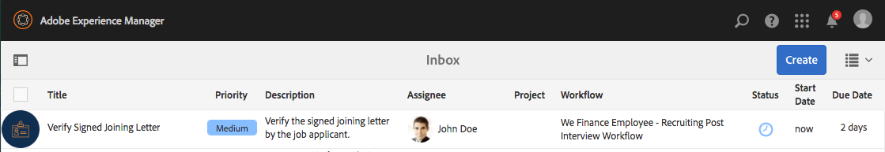
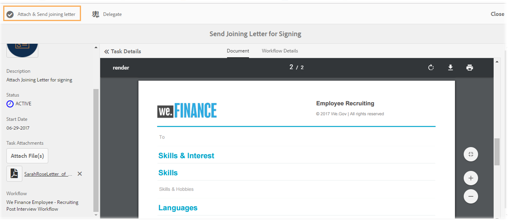

# Employee recruitment reference site walkthrough{#employee-recruitment-reference-site-walkthrough}

## Prerequisite {#prerequisite}

Set up the reference sites as described in [Set up and configure AEM Forms reference sites](../../forms/using/setup-reference-sites.md).

## Overview {#overview}

We.Finance is an organization that allows candidates to apply for employment through the reference site portal. The organization also uses the portal to manage candidates' interviewing scheduling, shortlisting, and internal communication. The site manages the following:

* Candidates searching and applying for jobs
* Screening and shortlisting of candidates
* Interviewing process  
* Collection of candidate details
* Candidate background checking
* Rolling out offers to selected candidates

<!--
Comment Type: annotation
Last Modified By: virai
Last Modified Date: 2017-06-15T02:43:44.296-0400
Check for consistent use of H1 and H2s etc. Some seem to be off.
-->

>[!NOTE]
>
>Employee recruitment use cases are available in both We.Finance and We.Gov reference sites. The examples, images, and descriptions used in the walkthroughs use We.Finance reference site. However, you can run these use cases and review artifacts using We.Gov as well. To do so, replace **we-finance** with **we-gov** in the mentioned URLs.

### Workflow models involved {#workflow-models-involved}

The employee recruitment use case involves two workflows:

* Before the interview - We Finance Employee Recruiting workflow
* After the interview - We Finance Employee Recruiting Post Interview workflow

These workflows are created in AEM and can be found at:

`http://[authorHost]:[authorPort]/libs/cq/workflow/admin/console/content/models.html/etc/workflow/models/`

#### We Finance Employee Recruiting workflow {#we-finance-employee-recruiting-workflow}

Following is the model of the We Finance Employee Recruiting workflow followed in this document.

#### We Finance Employee Recruiting Post Interview workflow {#we-finance-employee-recruiting-post-interview-workflow}

Following is the model of the We Finance Employee Post Interview Recruiting workflow followed in this document.

### Personas {#personas}

The scenario involves the following personas:

* Sarah Rose, the candidate applying for a job at the organization
* John Jacobs, the recruiter
* Gloria Rios, the hiring manager
* John Doe, the HR person

## Sarah applies for a job {#sarah-applies-for-a-job}

Sarah Rose is looking for a job opportunity in the organization. She visits their web portal and explores the job openings listed on the Career page. She finds a matching job listing and applies for it.

We.Finance home page

We.Finance career page

Sarah clicks Apply on a job posting. The job application form opens. She fills all the details in the application and submits it.

#### How it works {#how-it-works}

The We.Finance home page and the career page are AEM Sites pages. The career page embeds an adaptive form, which uses a repeatable panel to fetch job openings using a service and list them on the page. You can review the adaptive form at `http://[authorHost]:[authorPort]/editor.html/content/forms/af/we-finance/employee/recruitment/jobs.html`.

#### See it yourself {#see-it-yourself}

Go to `http://[publishHost]:[publishPort]/content/we-finance/global/en.html` and click **[!UICONTROL Career]**. Click **[!UICONTROL Search]** to populate the job list and then click **[!UICONTROL Apply]** for a job. Fill details in the form and submit the application.

Ensure that you specify a valid email ID in the application as any communication through this walkthrough will be sent to the specified email ID.

<!--
Comment Type: annotation
Last Modified By: gtalwar
Last Modified Date: 2017-06-21T01:45:53.114-0400
test the links
-->

## John Jacobs shortlists Sarah Rose's profile for the hiring manager's screening {#john-jacobs-shortlists-sarah-rose-s-profile-for-the-hiring-manager-s-screening}

<!--
Comment Type: annotation
Last Modified By: gtalwar
Last Modified Date: 2017-06-21T01:46:26.611-0400
Does this not need to be a specific persona instead of We.Finance?
-->

<!--
Comment Type: annotation
Last Modified By: gtalwar
Last Modified Date: 2017-06-21T03:15:48.007-0400
1:33 on the video
-->

<!--
Comment Type: annotation
Last Modified By: gtalwar
Last Modified Date: 2017-06-29T07:00:27.879-0400
Change all we.,gov and we.finanace to the organization and put a note on top that this article is applicable for both
-->

The organization receives the job application submitted by Sarah. John Jacobs, a recruiter, is assigned the task to review Sarah's profile. He reviews the task in his AEM Inbox, finds the profile matching the job requirement, and clicks Shortlist. Sarah's profile is forwarded to Gloria Rios, the hiring manager, for her approval. 

John's AEM Inbox

John Jacobs shortlists Sarah Rose's profile for the hiring manager's screening

**How it works**

The submit action in the Job Application form triggers a workflow that creates a task in John Jacob's inbox for screening the application. When John, reviews and shortlists the application, the workflow creates a task in the hiring manager, Gloria's inbox.

#### See it yourself {#see-it-yourself-1}

Go to `http://[publishHost]:[publishPort]/content/we-finance/global/en/login.html?resource=/aem/inbox.html`and log in using jjacobs/password as username/password for John Jacobs. Open the Candidate Profile Review task and shortlist the applicant.

## Gloria reviews the application and approves the applicant for an interview {#gloria-reviews-the-application-and-approves-the-applicant-for-an-interview}

<!--
Comment Type: annotation
Last Modified By: gtalwar
Last Modified Date: 2017-06-21T03:22:32.716-0400
2:07 on the video
-->

Gloria, the hiring manager, receives the shortlisted profile as a task in her AEM Inbox. She reviews it and approves the candidate, Sarah Rose, for the interview. 

Gloria's AEM inbox

Gloria approves Sarah Rose for an interview

**How it works**

When Gloria approves the candidate for an interview, the workflow creates a task in the AEM Inbox of John Doe, who is a recruiter for We.Finance.

#### See it yourself {#see-it-yourself-2}

Go to `http://[publishHost]:[publishPort]/content/we-finance/global/en/login.html?resource=/aem/inbox.html` and log in using jjacobs/password as username/password for John Jacobs. Open the Candidate Profile Review task and shortlist the applicant.

Go to `http://[publishHost]:[publishPort]/content/we-finance/global/en/login.html?resource=/aem/inbox.html` and log in using grios/password as username/password for Gloria Rios. Open the Candidate Profile Review task and click Schedule Interview.

## John Doe schedules an interview {#john-doe-schedules-an-interview}

<!--
Comment Type: annotation
Last Modified By: gtalwar
Last Modified Date: 2017-06-21T03:25:53.809-0400
2:34 on the video John or Gloria?
-->

John Doe receives the task of scheduling an interview in his inbox. John Doe selects and opens the task and fixes the interview date and time, location, and the HR person responsible for the interview as John Jacob. John Doe clicks Send Invitation Email. An email is sent to Sarah and a task is assigned to Gloria, the hiring manager, for interviewing Sarah.

<!--
Comment Type: annotation
Last Modified By: gtalwar
Last Modified Date: 2017-07-03T07:30:40.093-0400
at this moment - a task is assigned to the Hiring Manager
-->

John Doe's AEM inbox

John Doe schedules the interview and sends the details to Sarah Rose

## Sarah Rose receives the email with interview schedule {#sarah-rose-receives-the-email-with-interview-schedule}

<!--
Comment Type: annotation
Last Modified By: gtalwar
Last Modified Date: 2017-06-21T03:33:42.977-0400
4:45 on the video
-->

Sarah Rose receives the email with interview schedule, venue, and other details. She clicks Accept to signify that she is OK with the interview schedule and venue. As guided by the precise information, Sarah makes it to the interviews.

<!--
Comment Type: annotation
Last Modified By: gtalwar
Last Modified Date: 2017-07-03T05:48:37.421-0400
the same information is sent to the interviewers?
-->

Sarah Rose receives the interview schedule

## After the interviews, the Hiring Manager shortlists Sarah Rose {#after-the-interviews-the-hiring-manager-shortlists-sarah-rose}

<!--
Comment Type: annotation
Last Modified By: gtalwar
Last Modified Date: 2017-06-21T03:36:16.735-0400
5:30 on the video - check the wording of the heading
-->

After Sarah Rose goes through the interviews and clears them, Gloria Rios, the Hiring Manager, opens the Candidate Selection task from her inbox and clicks Select. Gloria Rios's decision is conveyed to the HR person, John Doe, for further processing.

Gloria's AEM inbox

Gloria Rios selects Sarah Rose after the interviews

## John Doe requests more information {#john-doe-requests-more-information}

Before asking a candidate to join the organization, her background needs to be checked. John Doe opens and reviews the selected applicant's details and finds that some of her employment and education details are not filled in as yet. John Doe clicks Need More Information. 

 

John Doe requests more information from Sarah Rose about her education and work experience

## Sarah Rose receives an email requesting further information {#sarah-rose-receives-an-email-requesting-further-information}

<!--
Comment Type: annotation
Last Modified By: gtalwar
Last Modified Date: 2017-06-28T12:12:52.900-0400
7:15 on the video Check this - there may be a confusion here.
-->

Sarah Rose receives an email notifying her that further information is required for processing her employment application. The email includes a link to the form for filling up the required information. 

Sarah Rose receives an email notifying that further information is required for processing her employment application

Sarah clicks the Provide Details link in the email. A form appears. Sarah fills up the required education and employment details as requested by John Doe and clicks Submit.

Sarah opens the additional information form by clicking the link in the email

Sarah fills up additional information as requested by John Doe and clicks Submit

## John Doe reviews the selected candidate profile for the additional information provided {#john-doe-reviews-the-selected-candidate-profile-for-the-additional-information-provided}

<!--
Comment Type: annotation
Last Modified By: gtalwar
Last Modified Date: 2017-06-21T06:38:45.831-0400
10:05 on the video
-->

John Doe selects the candidate review request and opens it. John Doe finds that Sarah has filled up all the information as required. After reviewing the application, John Doe clicks Approve. On approval by John Doe, the request to perform a background check on Sarah Rose is forwarded to John Jacobs.

John Doe's AEM Inbox

John Doe reviews the additional information provided by Sarah and approves it

## John Jacobs receives a background check request {#john-jacobs-receives-a-background-check-request}

<!--
Comment Type: annotation
Last Modified By: gtalwar
Last Modified Date: 2017-06-21T07:04:58.117-0400
10:40 on the video
-->

John Jacobs sees the background check request in his inbox. John Jacobs opens the task and reviews the information provided by Sarah Rose. After performing a background check, John Jacobs clicks Go Ahead to signify that the background check has been successful.

John Jacobs's AEM inbox

After performing the background check, John Jacobs clicks Go Ahead

## John Doe sends out the joining letter to Sarah Rose {#john-doe-sends-out-the-joining-letter-to-sarah-rose}

<!--
Comment Type: annotation
Last Modified By: gtalwar
Last Modified Date: 2017-06-21T07:06:45.033-0400
11:11 in the video
-->

<!--
Comment Type: annotation
Last Modified By: gtalwar
Last Modified Date: 2017-06-21T07:18:49.881-0400
check this again
-->

John Doe receives a request in his AEM inbox for sending the joining letter. John opens the request and views the details. John Doe attaches the joining letter PDF and then clicks Attach & Send Joining Letter.

John Doe's AEM inbox

John Doe sends out the joining letter for signing

## Sarah Rose receives and signs the joining letter {#sarah-rose-receives-and-signs-the-joining-letter}

Sarah Rose receives the joining letter for signing. Sarah clicks Click Here To Review And Sign Joining Letter. The joining letter PDF opens with a field to sign the document.

Sarah Rose receives the joining letter for signing

Sarah can choose either to type in, use draw to handwrite, insert an image of signature, or use her mobile's touchscreen to draw her signature. Sarah types in her name, clicks Click To Sign, and dwonloads the signed copy of the joining letter. 

Sarah types in her name to sign the joining letter

Sarah clicks Click To Sign to complete signing the joining letter

<!--
Comment Type: draft

<h2>John Doe verifies that the joining letter is signed and sends the offer of employment</h2>
-->

<!--
Comment Type: annotation
Last Modified By: gtalwar
Last Modified Date: 2017-06-29T07:10:45.930-0400
make this the last step - affter sarah signs the joining letter
-->

<!--
Comment Type: draft

John Doe receives a task to verify signed joining letter. John Doe selects and opens the task. John Doe verifies that Sarah Rose has signed the joining letter and clicks Attach & Send Joining Letter. 

-->

<!--
Comment Type: draft

-->

<!--
Comment Type: draft

-->

<!--
Comment Type: draft

<h2>Sarah Rose receives the offer of employment</h2>
-->

<!--
Comment Type: draft

Sarah Rose receives offer of employment on email. The email has the joining letter attached with it. Sarah reviews all the details and responds to the email with her consent to join the organization.

-->

<!--
Comment Type: draft

-->

