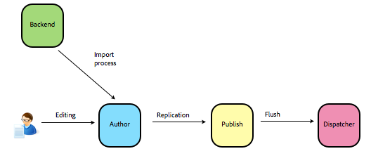
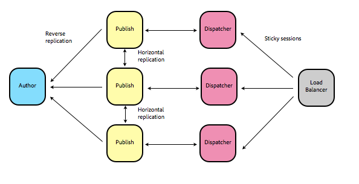

# Scaling{#scaling}

When scaling a CQ installation, deteriming the appropriate architecture can be complex. A CQ installation is composed of a number of distinct parts, each of which can be configured in a number of ways, yielding a large number of possible configuration combinations.

To help navigate these possibilities, in this section we describe a number of common use cases that all exhibit some type of scaling problem. For each, we present a number of possible solution patterns and tuning strategies.

The following use cases are presented:

* High Processing Input Feed
* High Volume Input Feed
* High Frequency Input Feed
* Many Editors
* High Volume and High Performance Delivery
* Many DAM Assets
* Geographically Distributed Editors

Note that the capacity numbers mentioned in this section are meant only for purposes of illustration. They should not be relied upon for detailed planning purposes. Once a candidate solution is found, testing against realistic loads specific to your situation is generally the only reliable way to validate that potential solution.

## Prerequisites {#prerequisites}

You should be familiar with the general overview and basic concepts of CQ as described in [Basic Concepts](/content/docs/en/aem/6-1/deploy#Basic Concepts), in particular:

* JCR Content Repository
* Author instance
* Publish instance
* Dispatcher
* Replication

## High Processing Input Feed {#high-processing-input-feed}

The scenario is:

* A number of assets must be imported at one time (for example, 1000 large images).
* On import the assets have to be processed, for example to produce various renditions of each.
* The processing step is CPU intensive.
* The importing may occur periodically, whenever required.
* Other editors must still be able to edit content normally at the same time as the import is occurring.

### Limiting Factors {#limiting-factors}

The limiting factor in this case is the CPU and memory capacity of the author instance.

### Solution Patterns {#solution-patterns}

#### Author Offload {#author-offload}

In CQ 5.6.1 **Author Offload** is the preferred solution. It consists of the following steps:

* **Separate Processing and Editing Instances**: Install a *processing* author instance, separate from the normal *editing* author instance.

* **Offload the Processing Step**: Asset ingestion is initiated by a user on the editing author. During the asset ingestion workflow, the step that does the actual processing is offloaded to the processing instance. This ensures that the high load task does not interrupt the normal everyday authoring activity, which still continues on the editing instance. See [Offloading Jobs](/content/docs/en/aem/6-1/deploy/configuring/offloading).

* **Use Binaryless Replication and Shared Data Store**: Configure a Shared Data Store between the processing and editing instances (and potentially, the publish instance). Configure binaryless replication between the processing instance and the editing instance (and between the editing instance and the publish instance, if it too shares the same data store). Once ingestion of an asset is complete and its various renditions have been created, the workflow should replicate the resulting assets back to the editing instance.  
  
  With a shared data store and binaryless replication configured, the resulting replication step will need to transfer only the *data store references* from processing to editing instance. The actual binary data will reside in the shared data store, and remain there. If the publish instance also shares the same data store then binaryless replication between editing and publish will be similarly improved.

#### Author Cluster {#author-cluster}

For pre-5.6.1 installations, where offloading is not available, one solution is to use author clustering configured as follows:

* **Create an Author Cluster**: Install an author cluster of two instances (one master, one slave).
* **Configure Dispatcher to Slave: ** Configuring the dispatcher so that all requests go to the slave ensures that normal authoring is done on the slave. However, when the asset import workflow is initiated, the actual processing will run on the *master* , since in a cluster, workflow processes always run on the master.  
  
  This solution also provides the reliability advantages of clustering, in that content is automatically "backed-up" from master to slave and vice versa.  
  
  A shared data store may be used. However, in a pre-5.6.1 installation (i.e., without binaryless replication) this will save storage space, but not improve performance.

#### Author Preprocessing {#author-preprocessing}

An alternative solution for pre-5.6.1 is **Author Preprocessing**. This solution consists of the following steps:

* **Separate Processing and Editing Instances**: Install a *processing* author instance, separate from the normal *editing* author instance.

* **Use Processing Instance for Preprocessing**: Unlike the cases above, here the initiation of asset uploading must be done on the preprocessing instance. The rendition creation etc. also occurs on the processing instance. When completed, the assets are replicated to the editing instance, and possibly, directly to the publish instances.

Like the author offload solution, this solution also relieves the editing author of the processing load. However, it has two disadvantages:

* Normal authoring and asset ingestion initiated must occur on distinct instances. Users must be aware of which instances they are using for which task.
* Though a shared data store can still be used among instances (including among author and publish instances) it will serve only to save file storage space. It will not prevent redundant replication of large binaries, as binaryless replication is not available in pre-5.6.1.

## High Volume Input Feed {#high-volume-input-feed}

The scenario is:

* A large volume of content (for example, millions of product records) are stored in a backend system.
* These records have already been imported into CQ.
* Every day some of these records (say 10,000) are changed on the back-end system.
* These changes must be reflected in CQ content on a daily basis.
* However, the backend system *cannot* provide a diff of the changes. Determining which records are to be updated must be done by reading every record on the backend and comparing it to content on CQ.
* Normal editing must continue on author while the daily import occurs.

### Limiting Factors {#limiting-factors-1}

The limiting factors are:

* A large number of read operations on the repository will occur since every record must be touched to determine whether it requires update. This can negatively affect global reposiotry performance, interrupting normal author editing.
* The processing load from the compare operation may also negatively affect editing performance, depending on how the compare is done.
* Despite only writing those records that are changed, this may still represent a large write load, which may negatively affect normal editing performance

### Solution Patterns {#solution-patterns-1}

#### Import Author {#import-author}

The recommended solution in this case is the **Import Author**:

* Similar to the **Preprocessing Author **solution above, a special author instance separate from the *editing author* is set up to deal with the task of diffing the incoming records against the existing content. 

* The import author holds a copy of the product catalog initially imported from the backend system. 
* On a daily schedule the import author reads in the entire product catalog from the backend system and compares each record to its own product data, it applies the required changes to its own copy of the content while programmatically building a package of those changes for replication to the editing author.
* Normal authoring continues on the editing author instance.
* Once the product information is updated and the package built, it is replicated to the editing author. In some cases it may also be appropriate to replicate the resulting package directy to the publish instance(s). 
* Note that in some cases such direct-publish replication from the import author will not work. For example, with CQs eCommerce solution, the product information must be replicated to the editing author, where it is further processed and then replicated to the publish instances.

#### Import Author with Sharding {#import-author-with-sharding}

A variant of the Import Author solution is to "shard" the content between the two author instances. In this scenario the two instances are not clustered and in fact are not even linked by replication.

* The instances store their respective contents in distinct subtrees of the repository: The product catalog resides on the import author under `/products` while the regulart content resides on the editing author under `/content`.

* Import proceeds as above except that once the package of changes has been compiled by the import author instance it is replicated *directly to publish*.
* Similarly, normal editing proceeds on the editing instance and are replicated directly to publish through normal page activation.
* The disadvantage of this method is that the two parts of the content are entirely disconnected. A normal editor cannot, for example, create a working link on a page to a product in the catalog since the catalog does not exisit on the editing author. The link would have to be created "blindly" according to some predefined syntax and would only work once published.

#### Import Author with Clustering {#import-author-with-clustering}

Another variant of the import author solution is that instead of the import and editing authors being entirely separate instances linked by package replication (i.e. from import to editing) the two are master and slave within a cluster:

* This means that when the import author updates a record, it is immediately reflected on the editing author due to cluster synchronization. No replication is needed.
* In this case the dispatcher must be set up so that normal editing occurs only on the slave (the editing instance). The importing task can then be set up as a workflow that can be initiated on the slave but (like all workflows) actually executes on the master and performs the import and diff comparison there.
* An advantage of this approach is that the two author instamnces are less likely to become unsynchronized than in the case of a replication link.
* A possible disadvantage is that because writes made when updating the import instance are immediately synchronized, the editing author will experience the same write load at the same time as the import author (though not the same read load or processing load, and these are, as menioned more likely to be bottlenecks, see above). In the replication case that write load only occurs periodically, on actual import of the package recording the daily changes.

<!--
Comment Type: draft

-->

### Tuning Strategies {#tuning-strategies}

Even when the write load on import is reduced through use of a diff, it may, in cases where a very large number of changes needs to be written, still affect performance of simultaneous editing. In such cases further tuning may be required. The following describes some straties that can be used to mitigate this problem.

#### Shared Data Store {#shared-data-store}

Adding a shared data store can significantly reduce redundant writes in cases where the data consists of large binaries.

* A single data store should shared among all instances: import author, editing author and all publish instances.
* For CQ 5.6.1 or later, all replication channels should be set to *binaryless*, preventing the unnecessary transfer of large data objects.
* For pre-5.6.1 installations binaryless replication is unavailable. However, a similar effect can be achieved between import author and editing author by using the **Import Author with Clustering** and having a data store shared between the cluster nodes. Data transfer between cluster nodes that share a data store is always, in effect, *binaryless*.  
  
  Note that in this case the binaryless transfer would not extend to the publish instance(s), even if they shared the same data store. Though it may still be worth having the shared data store just to save storage space.

#### Import Throttling {#import-throttling}

If performance problems on the editing author are caused by a too-heavy write load, one approach is to the throttle the writing. This means tuning your import process so that it writes changes to the repository in batches, interspersed with sleep statements that allow other processes (such as those performing normal editing). For the Import Author scenario, this means optimizing the code that writes the import package to the editing author. For the Import Author with Clustering scenario, this would involve optimizing the code that writes the imported data to the import author in the first place (since it is automatically synchronized to the editing author, the pace of writing to the import author will determine the pace of writing the editing author).

#### Batch Saves {#batch-saves}

In addition to throttling the pace of the import, it is also recommended that the actual saving of content to the repository should be done in batches. For this purpose the JCR API provides the `Session.save` command, which saves all pending changes ( `Node.save`, in contrast, only saves those changes that apply to a particular JCR node). A reasonably strategy is to save in bunches of approximately 1000 nodes.

In pre-5.6.1 installations avoid the use of the `PageManager` for import, because it cannot operate in batch mode. In 5.6.1 and later, you can operate `PageManager` in batch mode, though coding at the JCR API level using `Session.save` is still the recommended approach when wiring your importer.

#### Use nt:unstructured {#use-nt-unstructured}

Another useful strategy when saving imported content is to save the content in the form of `nt:unstructured` nodes as opposed to `cq:Page` nodes. The creation of a `cq:Page` node triggers a number of listeners and kicks-off extra processes which will slow down the import.

Alernatively, you can create `cq:Page` nodes but turn off the heavy-wight listener services (for example, `ContentSync`) or use the `JcrObservationThrottle`.

#### No NAS {#no-nas}

The content repository consists of a number of storage elements, most importantly the main content store (also called the persistence manger store or the fine-grained content store) and the data store (See [Persistence Managers and Other Storage Elements](/content/docs/en/aem/6-1/deploy/upgrade/persistence-managers)).

The main content store holds the repository hierarchy of node and properties. The values of most properties are stored inline within the main content store, however, large binary properties are stored in a separate are, the data store, with a reference to the binary data held in the hierarchy.

As mentioned, the data store, particularly when it is shared among different instances can be stored on a network disk or in a remote storage service like S3 (Preview Technology).

However, it is imperative that the main content store (the Persistence Manager store) not be placed on a NAS drive. It should always be placed in a local drive on the same machine that is actually running the instance or on a SAN that has equivalent throughput and access times as local storage. It can generally be said that Persistence Manager Performance will benefit greatly from fast storage: if you have the opportunity, use SSDs. Other local disks and fast SAN disks are fine as well, but do not use NAS or other IP-based network storage.

#### Separate Replication Queues {#separate-replication-queues}

You should avoid replicating your imported content (the product info) to publish through the same replication queue as is used for editorial content. This might heavily delay important editorial changes from publication.

A better solution is to set up two separate replication agents for each part of the content (for example, one agent sees only `/products` and the other only sees `/content`).

Note that links from editorial content to product content may break if only the editorial content is activated while the product content activation is delayed, so it must be ensured that the product content is always ahead of editorial content. One possible solution is to replicate the product content as soon as it is available after the import, while editorial content follows after, being replicated only upon explicit request. Another option would be to wrap activation of editorial content into a workflow that checks the last replication date of product content that it depends upon.

In the case of **Import Author Sharding **this consistency is already ensured, since the two types of content are on separate instances to begin with and go directly from their author instances to the publish instance on entirely separate replication queues.

## High Frequency Input Feed {#high-frequency-input-feed}

A news feed with a moderate but constant volume of updates that must be continually published.

### Limiting Factors {#limiting-factors-2}

The limiting factor in this case is the CPU load on the publish instance because every time a news item is pushed to publish the corresponding cache in the dispatcher is invalidated (since the dispatcher's cached copy of the page in question is no longer up-to-date). Consequently the next request for that page will be passed by the dispatcher back to the publish instance which will re-render the page, putting processing load on the publish instance. If the content updates are frequent enough, the dispatcher cache may be bypassed and page re-renders done so often that the load on the publish instance becomes unmanageable.

### Solution Patterns {#solution-patterns-2}

#### Separate Dynamic From (Relatively) Static Content {#separate-dynamic-from-relatively-static-content}

The first solution to try is to set up the content structure so that on each news update as little as possible of the dispatcher cache gets invalidated. For example the main page holding the news feed could remain relatively static while embedding an iframe that referenced a simple (and highly dynamic) newsfeed page. In this case only the newsfeed page would be invalidated un update while the surrounding main page would not need to be continually re-rendered.

If possible, put high volatile content in `/etc`. With Dispatcher 4.1.4 , a single-page flush on just the specific highly dynamic newsfeed page is possible (see [Manually Invalidating the Dispatcher Cache](https://docs.adobe.com/content/docs/en/dispatcher/page-invalidate.html#Manually Invalidating the Dispatcher Cache)).

Note that it, in general, it is important that you understand the dependencies between your cached pages in order to come up with the right caching strategy.

It may also be useful separate the replication queues so that the main queue is used for normal editorial changes while an special newsfeed queue is used for the highly dynamic content.

####  Import Feed Directly to Publish {#import-feed-directly-to-publish}

<!--
Comment Type: draft

In some case it might be possible to import and continually update the newsfeed directly to the publish instance, bypassing the need for author-to-publish replication. Of course this would only be feasible if human filtering or processing of the feed content was not needed. If it is, then importing it to author is the best course. If it is not, you must further ask whether in your case it is acceptable to have different states on different publish instances (assuming you have more than one), because with direct import such discrepancies are sure to arise. If it is acceptable than direct-to- publish import is a a good option.

-->

In some case it might be possible to import and continually update the newsfeed directly to the publish instance, bypassing the need for author-to-publish replication. Of course this would only be feasible if human filtering or processing of the feed content was not needed. If human filtering is not required, then importing directly to the publishers is the best course. You should ensure the import starts at the same time on each publisher to achieve consistent results accross publishers.

## Many Editors {#many-editors}

A media portal or a news service with 50 or more editors editing content at the same time.

### Limiting Factors {#limiting-factors-3}

The limiting factors depend on what the editors do:

* Heavyweight editing such as multi-site manager rollouts or starting workflows could lead to a repository bottleneck, as they entail many write operations (for rolling out content, keeping track of workflow state, audit logging, etc).
* Lightweight editing such as adding, deleting and correcting text paragraphs and adding and deleting images could lead to a CPU processing bottleneck.

### Solution Patterns {#solution-patterns-3}

#### Author Sharding {#author-sharding}

Dividing the the content across multiple author instances would reduce the load on each author. For example, author A would host `/content/foo/*` while author B would host `/content/bar/*`.

The two (or more) author instances would each publish their content via replication to all publish instances, so that each publish instance would end up receiving the full content tree.

The disadvantage of this approach is that linking across content shards would be more difficult, since the links would only resolve correctly once all content was replicated to publish. If however you have areas of content that are entirely independent of each other, this is the recommended approach to scaling.

<!--
Comment Type: draft

<h4>Author Sharding with Single Main Author</h4>
-->

<!--
Comment Type: draft

A variation on the above solution is to have separate sharded authors instances for different parts of content but to then replicate these to a single main author instance.

-->

<!--
Comment Type: draft

-->

### Tuning Strategies {#tuning-strategies-1}

#### Author Dispatcher {#author-dispatcher}

Installing a dispatcher in front of the author instances can helps to reduce CPU load on those instances. This is because, despite the fact that author instances are used for writing, in most cases reads still make up 80% of the requests to an author instance (to display the editing environment, etc.).

<!--
Comment Type: draft

<h4>Author Templates</h4>
-->

<!--
Comment Type: draft

Another solution is to implement special author templates that only appear on the authoring instance. These templates can be simpler and less heavy than the production templates on publish, and will therefore reduce load on the author.

-->

## High Volume and High Performance Delivery {#high-volume-and-high-performance-delivery}

A high traffic site (100 millions of impressions per day).

### Limiting Factors {#limiting-factors-4}

The limiting factor is the CPU load on the publish instances.

### Solution Patterns {#solution-patterns-4}

#### Add more publishers {#add-more-publishers}

Scaling publishers is typically very straight forward: you can scale very far by just adding more publishers and corresponding Dispatcher instances.

One factor that limits this at some point is the number of replication queues required on the author instance, but this is not typically relevant for low two-digit numbers of publishers per author instance.

#### Leverage the Dispatcher {#leverage-the-dispatcher}

The first step is to leverage the dispatcher caching as well as possible:

* Make sure that all content that is of static nature can be cached and is actually cached on Dispatcher
* Make sure that your implementation follows AEM architecture patterns for personalized content and uses the Client Context, so that only few XHR requests are required for personalization, while HTML output is free of personalized content and can be cached on Dispatcher.
* If you have dynamic content that cannot be fully aggregated on the client side, use server-side includes on Dispatcher to separate static HTML from dynamic content so that the static parts can still be cached.
* Use selectors instead of query parameters if you have a well-defined list of possible parameter values. Results based on selectors are cached by default.
* If required, you can take tighter control of Dispatcher cache invalidation by [manually invalidating or flushing content from Dispatcher](https://docs.adobe.com/content/docs/en/dispatcher/page-invalidate.html#Manually Invalidating the Dispatcher Cache).

<!--
Comment Type: draft

-->

#### Use a CDN {#use-a-cdn}

A further possible step is to set up an external Content Delivery Network (CDN) to cache content closer to your users. You should ensure that the CDN is configured with a suitably short Time To Live (TTL).

#### Improve Rendering and Delivery {#improve-rendering-and-delivery}

Caching goes hand in hand with optimizing your deployment and custom development to perform well when the caching layers do not offload the requests.

There are many factors which influence your instances' performances, which are documented elsewhere in greater depth:

* [Performance Optimization](/content/docs/en/aem/6-1/deploy/configuring/performance) (AEM Documentation)
* [CQ Development - Guidelines and Best Practices](/content/docs/en/aem/6-1/develop/the-basics/dev-guidelines-bestpractices)
* [Performance Tuning Tips](http://helpx.adobe.com/cq/kb/performancetuningtips.html) (Knowledge Base Article)
* [DAM Performance Guide](/content/docs/en/aem/6-1/deploy/configuring/performance/assets-performance-sizing)

Many aspects are also part of general web development best practices and not particular to AEM deployments, such as

* reducing number and heaviness of requests by minifying and concatenating JavaScript in CSS (in AEM, the [Client Library Manager](/content/docs/en/aem/6-1/develop/the-basics/clientlibs) helps with this)
* using CSS sprites
* sending deflated responses

## Many DAM Assets {#many-dam-assets}

In this use case the issue is the large number of DAM assets in the repository (say, over 5 million).

### Limiting Factors {#limiting-factors-5}

The limiting factor in this case is disk space.

### Solution Patterns {#solution-patterns-5}

#### Leverage the Data Store {#leverage-the-data-store}

The best solution in such a case is to leverage the data store:

* Configure a data store shared across as many of your CQ instances as possible.
* If you are using CQ 5.6.1 or later, set all replication queues between instances that share that data store to "binaryless". This will prevent the redundant transfer of large binaries between instances.
* Make sure that there is at least one instance (usually an author instance) that maintains references to all current DAM assets in the data store. Garbage collection of the data store must be run on this instance only.
* Keep in mind that while the main repository storage (the PM store) requires a disk with very low latency (i.e., a local disk on the instance machine), the data store can be can be kept in higher-latency (and cheaper) remote storage such as network attached storage (NAS) or cloud storage (Amazon S3, Preview Technology). 
* Note that in 5.6.1, there are huge performance improvements (about 10x or more) for the data store garbage collection if the persistence manager uses tar-based storage.

## Geographically Distributed Editors {#geographically-distributed-editors}

In this use case, editors are located in different geographical locations (US, EMEA, APAC).

### Limiting Factors {#limiting-factors-6}

The limiting factor is the bandwidth between the editor location and the author server location.

### Solution Patterns {#solution-patterns-6}

#### Author Dispatcher {#author-dispatcher-1}

Use a dispatcher in front of the author instance, but keep the dispatcher machine geographically close to the editor, to provide maximum bandwidth between dispatcher and and the editor for all content that can be cached in Dispatcher. See [Using a Dispatcher with an Author Server](https://docs.adobe.com/content/docs/en/dispatcher.html#Using%20a%20Dispatcher%20with%20an%20Author%20Server) for Details.

#### Reduce Browser Traffic {#reduce-browser-traffic}

Reduce the traffic between the dispatcher and the editor's browser, for example by:

* Use the web server to deflate responses to the client (e.g. Apache's mod_deflate) 
* Minify and concatenate all client libraries.
* Cache all responses for non-authorable content in the editor's browser cache by configuring the expiry headers in dispatcher (e.g. using Apache's mod_expires)

