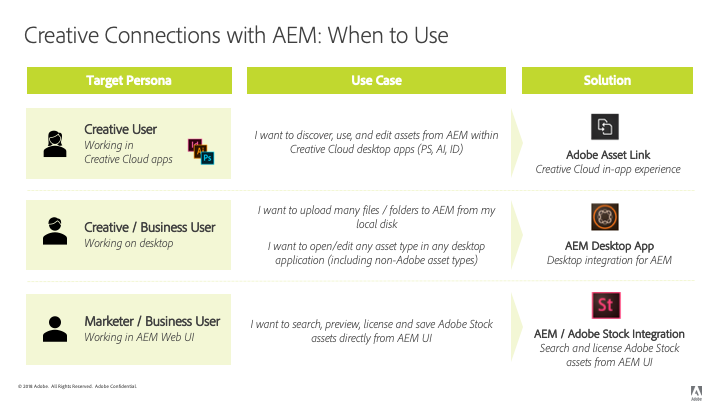

# AEM and Creative Cloud integration best practices {#aem-and-creative-cloud-integration-best-practices}

<!-- TBD: Reconcile with 6.5 article that's ahead of this article now in terms of content streamlining and structuring.
-->

Adobe Experience Manager Assets is a digital asset management (DAM) solution that can integrate with Adobe Creative Cloud to help DAM users work together with creative teams, streamlining collaboration in the content creation process.

Adobe Creative Cloud provides creative teams with an ecosystem of solutions and services to help them to create digital assets. It includes desktop and mobile applications, cloud services like storage with desktop sync or web experience, as well as marketplaces like Adobe Stock.

Read on to know what integrations to pick between desktop and the enterprise-grade DAM based on your use case and what are the associated best practices for the connecting workflows.

>[!NOTE]
>
>AEM to Creative Cloud folder sharing is deprecated and no longer covered in this guide. Adobe recommends using newer capabilities such as [Adobe Asset Link](https://helpx.adobe.com/enterprise/using/adobe-asset-link.html) or [AEM desktop app](https://experienceleague.adobe.com/docs/experience-manager-desktop-app/using/introduction.html) to provide creative user with access to assets managed in AEM.

## Collaboration needs of creatives, marketers, and DAM users {#collaboration-needs-of-creatives-marketers-and-dam-users}

| Requirements | Use case | Involved surfaces |
|---|---|---|
| Simplify experience for creatives on desktop | Streamline access to asset from a DAM (AEM Assets) for creative professionals, or more broadly, users on desktop working in native asset creation applications. They need an easy and straightforward way to discover, use (open), edit and save changes to AEM, as well as upload new files. | Win or Mac desktop; Creative Cloud apps |
| Provide high-quality, ready-to-use assets from Adobe Stock | Marketers help accelerate the content creation process by assisting with asset sourcing and discovery. Creative professionals use the approved assets right from within their creative tools. | AEM Assets; Adobe Stock marketplace; metadata fields |
| Distribute and share assets by organizations | Internal departments/local branches and external partners, distributors, and agencies use the approved assets shared by the parent organization. The organization wants to securely and seamlessly share the created assets for wider reuse. | Brand Portal, Asset Share Commons |

## Adobe offerings to support the collaboration need {#adobe-offerings-to-support-the-collaboration-need}

| Value proposition for the involved personas | Adobe offering | Involved surfaces |
|---|---|---|
| Creative users discover assets from AEM, open and use them, edit and upload changes to AEM, as well as upload new files into AEM, without leaving Creative Cloud apps. | [Adobe Asset Link](https://helpx.adobe.com/enterprise/using/adobe-asset-link.html) | Photoshop, Illustrator, and InDesign |
| Business users simplify opening and using assets, editing and uploading changes to AEM, and uploading new files into AEM from the desktop environment. They use a generic integration to open any asset type in the native desktop application, including non-Adobe ones. | [AEM desktop app](https://experienceleague.adobe.com/docs/experience-manager-desktop-app/using/using.html) | AEM desktop app on Win and Mac desktop |
| Marketers and business users discover, preview, license and save, and manage the Adobe Stock assets from within AEM. Licensed and saved assets provide select Adobe Stock metadata for better governance. | [Experience Manager and Adobe Stock integration](aem-assets-adobe-stock.md) | AEM web interface |

This article focuses primarily on the first two aspects of the collaboration needs. Distribution and sourcing of assets at scale is briefly mentioned as a use case. For such needs solutions, consider Adobe Brand Portal or Asset Share Commons. Alternate solutions such as [Brand Portal](https://helpx.adobe.com/experience-manager/brand-portal/user-guide.html), solutions that can be built based on [Asset Share Commons](https://adobe-marketing-cloud.github.io/asset-share-commons/) components, [Link Share](/help/assets/link-sharing.md), using [Experience Manager Assets](/help/assets/managing-assets-touch-ui.md) should be reviewed based on specific requirement.

<!-- 
## Terms and definitions {#terms-and-definitions}

The terms used in this document may have a different meaning in other contexts. In particular, the following terms pertaining to the digital asset lifecycle are used when referring to workflows between a creative professional's desktop and DAM:

* **Work-in-progress or creative work-in-progress (WIP):** A phase in asset lifecycle where an asset undergoes multiple changes and is typically not yet ready to be shared with broader teams.
* **Creative-ready assets:** Assets that are ready to be shared with a broader team, or have been  selected / approved  by the creative team for sharing with marketing or LOB teams.
* **Asset approvals:** The approval process that runs for assets already uploaded to DAM, which typically includes brand approvals, legal approvals, and so on.
* **Final asset:** An asset that has gone through all  approvals/metadata  tagging and is ready to be used by the broader team. Such an asset is stored in DAM and made available to all (or all interested) users. It can be used in marketing channels or by creative teams to create designs.
* **Minor asset  update/change:** A quick and small change to a digital asset. It is often made in response to a retouching or minor editing request, asset review, or approval (for example, reposition, change text size, adjust saturation/brightness, color, and so on).
* **Major asset  update/change:** A change to a digital asset that requires considerable work, and sometimes must be done over a longer period of time. It typically includes multiple changes. The asset must be saved multiple times while being updated. Major asset updates typically cause the asset to enter a WIP stage.
* **DAM:** Digital asset management. In this document, it is synonymous with AEM Experience Manager Assets, unless specifically mentioned otherwise.
* **Creative user:** A creative professional, who creates digital assets using Creative Cloud apps and services. In some cases, a creative user may be a member of a creative team who may use Creative Cloud, but does not create digital assets (like a creative director or creative team manager).
* **DAM user:** A typical user of a DAM system. Depending on the organization, a DAM user can be a marketing or a non-marketing user, for example a Line-of-Business (LOB) user, librarian, sales person, and so on.
-->

### Mapping of use cases 

| Use case | AEM desktop app | Folder sharing | Other solutions |
|---|---|---|---|
| Share smaller number (1) of DAM assets with Creative user | ✔✔ | ✔ | |
| Share larger number (2) of DAM assets with Creative user | ✔✔ | ✘ | [Brand Portal](https://experienceleague.adobe.com/docs/experience-manager-brand-portal/using/home.html)   [Asset Share](assets-finder-editor.md) |
| Share DAM assets with users who have access to DAM | ✔✔ | ✔ | [Link Share](link-sharing.md) |
| Share DAM assets with users who don't have access to DAM | ✘ | ✔✔ | [Brand Portal](https://experienceleague.adobe.com/docs/experience-manager-brand-portal/using/home.html)   [Asset Share](assets-finder-editor.md) |
| Save smaller number/volume of assets to DAM | ✔✔ | ✔ | [Web UI Upload](managing-assets-touch-ui.md) |
| Save larger number of assets to DAM (3) | ✔✔ | ✘ | [Web UI Upload](managing-assets-touch-ui.md)   Custom script / tool |
| Migrate huge number of assets to DAM | ✘ | ✘ | [Migration Guide](assets-migration-guide.md) |
| Quickly open an asset on desktop | ✔✔ | ✘ | |
| Quickly open and change asset on desktop | ✔✔ | ✘ | |

The legend for the symbols:

* ✔✔: preferred solution
* ✔: acceptable solution
* ✘: shouldn't be used for the use case

Additional remarks:

* (1) Smaller number of assets: for example, a small set of assets related to a project or campaign
* (2) Larger number of assets: for example, all approved assets in the organization
* (3) Use AEM desktop app upload folder feature

To support asset distribution use cases, other solutions should be considered:

* [Brand Portal](https://helpx.adobe.com/experience-manager/brand-portal/user-guide.html) for a configurable, SaaS add-on to AEM Assets to publish assets.
* Custom solutions are created based on [Asset Share Commons](https://adobe-marketing-cloud.github.io/asset-share-commons/) code base.
* AEM [link share](/help/assets/link-sharing.md) to share assets ad hoc using links.
* [AEM Assets web interface](/help/assets/managing-assets-touch-ui.md) with areas for external parties secured by AEM Access Control setup and with necessary IT / network configuration adjustments, giving these external users access to AEM.

## Key concepts and use cases {#key-concepts-and-use-cases}

### Glossary of common terms {#glossary-of-common-terms}

* **Work-in-progress or creative work-in-progress (WIP):** A phase in asset lifecycle where an asset undergoes multiple changes and is typically not yet ready to be shared with broader teams.
* **Creative-ready assets:** Assets that are ready to be shared with a broader team, or have been  selected / approved  by the creative team for sharing with marketing or LOB teams.
* **Asset approvals:** The approval process that runs for assets already uploaded to DAM, which typically includes brand approvals, legal approvals, and so on.
* **Final asset:** An asset that has gone through all  approvals/metadata  tagging and is ready to be used by the broader team. Such an asset is stored in DAM and made available to all (or all interested) users. It can be used in marketing channels or by creative teams to create designs.
* **Minor asset update/change :** A quick and small change to a digital asset. It is often made in response to a retouching or minor editing request, asset review, or approval (for example, reposition, change text size, adjust saturation/brightness, color, and so on).
* **Major asset update/change :** A change to a digital asset that requires considerable work, and sometimes must be done over a longer period of time. It typically includes multiple changes. The asset must be saved multiple times while being updated. Major asset updates typically cause the asset to enter a WIP stage.
* **DAM:** Digital asset management. In this document, it is synonymous with AEM Experience Manager Assets, unless specifically mentioned otherwise.
* **Creative user:** A creative professional, who creates digital assets using Creative Cloud apps and services. In some cases, a creative user may be a member of a creative team who may use Creative Cloud, but does not create digital assets (like a creative director or creative team manager).
* **DAM user:** A typical user of a DAM system. Depending on the organization, a DAM user can be a marketing or a non-marketing user, for example a Line-of-Business (LOB) user, librarian, sales person, and so on.

### Considerations when using AEM and Creative Cloud integration {#considerations-when-using-aem-and-creative-cloud-integration}

* See [desktop app best practices](https://experienceleague.adobe.com/docs/experience-manager-desktop-app/using/troubleshoot.html#best-practices-to-prevent-troubles)
* See [Adobe Stock integration](aem-assets-adobe-stock.md)
* See [Adobe Asset Link](https://helpx.adobe.com/enterprise/using/adobe-asset-link.html)

This is a brief summary of best practices for Experience Manager and Creative Cloud integration. Read the rest of this document to get the detailed understanding of these.

* **For creative users, working in Photoshop, InDesign, or Illustrator:** Adobe Asset Link provides the best user experience, including clean handling of the Work-in-progress on assets checked out from AEM
* **For simplifying access to assets from desktop for any generic file format or application:** use AEM desktop app
* **Understand why and when to store assets in DAM:** Updates to be made available to the broader team in your organization
* **Mind the volume of assets shared:** If your use case is asset distribution, governance and security might be the most important aspects. Consider using tools built for doing that at scale, like Brand Portal.
* **Understand asset lifecycle:** Know how assets are handled in your organization by different teams
* **Handle frequent saves to assets with care:** Adobe Asset Link takes care of that for you with PS, AI, ID. For other applications, don't carry out work in progress tasks in mapped/shared folder unless you need all the changes in DAM

### Access to Adobe Stock assets from AEM Assets {#access-to-adobe-stock-assets-from-aem-assets}

[AEM and Adobe Stock integration](/help/assets/aem-assets-adobe-stock.md) provides AEM users with the ability to search, preview, license and save, assets from Adobe Stock into AEM. Licensed and saved Adobe Stock assets have selected Stock metadata, which can be used to search for them with extra filters.

A few important points about this integration:

* When assets from Adobe stock are saved to AEM, they become a regular AEM Assets, with binary saved to the AEM repository. Some metadata related to Adobe Stock are saved for the asset in AEM, otherwise the ingestion process looks the same as for any other file. For example, if Smart Tags are active, the tags are added to these assets upon saving.
* The asset saved to AEM is a copy, not a link back into Adobe Stock.

**Working with assets saved from Adobe Stock into AEM in Creative Cloud**. This integration is independent of Adobe Asset Link, but Adobe Asset Link recognizes these assets saved from Stock that way, and displays additional metadata and Stock icon on these assets in Adobe Asset Link extension UI in Photoshop, Illustrator, or InDesign. The files are available for browsing, opening, and so on - because they are regular AEM assets when saved to AEM.
Creative users working in Creative Cloud apps with Adobe Asset Link extension present, in addition to having access to already-licensed assets from Adobe Stock into AEM, can also use Creative Cloud Libraries panel to search, preview, and license Adobe Stock assets.
Assets from Adobe Stock licensed and saved into AEM become available to the broader teams accessing AEM Assets deployment, whereas creatives licensing assets from Adobe Stock via Creative Cloud Libraries panel make them available to themselves only by default in their Creative Cloud account.

<!-- 
TBD: A condensed version of the below content is better placed in the Adobe DAM article.
-->

## About storing assets in a DAM {#about-storing-assets-in-a-dam}

To design an efficient workflow between creative and marketing/line-of-business (LOB) teams and choose the best support capabilities, it is important to understand when and why assets are stored in DAM.

### Why assets are stored in DAM {#why-assets-are-stored-in-dam}

Storing assets in DAM makes them easily accessible and findable. It ensures that the assets can be leveraged by numerous users across the organization or ecosystem, which includes partners, customers, and so on.

Most organizations choose to only store assets that are relevant to the downstream marketing/LOB processes (publishing to channels like web channel via AEM Sites or other channels served by Adobe Experience Cloud, Advertizing Cloud, and measured by Analytics Cloud, providing to users/partners, and so on). In addition, organizations store assets that may be subjected to a review/approval process in DAM. This way, DAM stores mostly assets that have high chances of being leveraged, and avoids storing idle assets.

Storing assets is also subject to technical and resource utilization considerations. DAM provides additional services around stored assets, including extracting metadata, versioning, generating previews/transcoding, managing references, and adding access control information. These services consume additional time and infrastructure resources.

Often, storing all of the assets and updates is not desirable. For example, if updates to specific assets are of poor quality and consume excessive resources, the assets may not be stored in DAM.

### When assets are stored in DAM {#when-assets-are-stored-in-dam}

Creative teams (and organizations) are usually not interested in storing assets at each stage of the asset lifecycle. For example, they avoid storing assets in the following cases:

* Assets that are yet to be finalized or are subject to experimentation
* Assets that fail to pass the creative/internal team review cycle
* Compared to the asset in question, the team has better candidates to represent their work to external teams

Usually, the following classes assets are stored in DAM:

* Assets that reached a certain maturity and are considered ready to be shared
* Assets that were pre-selected by the creative team
* Specific asset formats that are usable or requested by marketing, depending on a specific contract or agreement (for example, JPG files converted from RAW files, TIFFs/images from PSD originals)

### When updates to assets are stored in DAM {#when-updates-to-assets-are-stored-in-dam}

As a rule, only updates to assets that are relevant to the broader set of DAM users should be stored in DAM. It ensures that users (marketing and similar functions) only see relevant versions in the DAM asset timeline.

Typically changes related to major milestones in the asset lifecycle. For example, the initial creative-ready asset or an official update based on request/review provided by the creative team should be stored and versioned in DAM.

The creative team's update for review by the marketing team after a request for a change in the existing asset in DAM is an example of a relevant update. It should be stored and versioned in DAM for further reference or for reverting to the previous version.

The following are examples of updates that are typically not relevant:

* Early versions of assets uploaded before it is ready for marketing review
* Frequent creative changes to the asset in the work-in-progress phase before creative team decides the asset is ready

### User access to DAM {#user-access-to-dam}

AEM Assets supports two types of users based on their access to the AEM Assets deployment. Typically, users inside the enterprise network (firewall) have a direct access to DAM. Other users outside the enterprise network would not have a direct access. The user type determines which integrations can be used from the technical standpoint.

#### Creative users with direct access to DAM {#creative-users-with-direct-access-to-dam}

Typically, in-house creative teams or agencies/creative professionals  onboarded  to the internal network have access to the DAM instance, including AEM login.

In such cases, AEM desktop app helps provide easy access to final/approved assets and lets you save creative-ready assets to DAM.

#### Creative users without access to DAM {#creative-users-without-access-to-dam}

External agencies and freelancers without direct access to the DAM instance may require access to approved assets or want to add their new designs to the DAM.

In such cases, you can leverage the AEM/Creative Cloud integration to improve the workflow. The prerequisite is for the creative users to have an Adobe ID and have a Creative Cloud account with storage service.

Use the following strategies to provide access to final/approved assets:

* To provide access to a large number assets: Use [AEM Assets Brand Portal](https://experienceleague.adobe.com/docs/experience-manager-brand-portal/using/home.html), or customer’s implementation of [Asset Share](assets-finder-editor.md) on AEM publish infrastructure

* To provide access to a few assets: AEM folder sharing with Adobe Creative Cloud can be used in addition to AEM Assets Brand Portal or Asset Share. Please note there are certain limitations related to this integration, covered in more detail in this article.

### Use Cases {#use-cases}

The following use cases describe various types of workflows between DAM and designer’s desktop.

#### Create new designs using assets from DAM {#creating-new-designs-using-assets-from-dam}

The following diagram illustrates the digital asset lifecycle. It depicts how creative users and DAM users (marketers, LOB users) leverage existing assets and use them to create more assets, and send them for approval.

The asset lifecycle includes the following stages:

1. Share approved assets to creative desktop: Final assets from DAM are made available to the creative user (on desktop)
1. Create a new design (creative digital asset): A new file is stored in the work-in-progress (WIP) area.
1. Use (place) approved assets in a new design: The creative user produces a new asset using existing approved assets in Creative Cloud apps  
1. Frequently saving WIP updates: The creative user iterates quickly and saves the file frequently. At this stage, the creative user may collaborate with others, but the frequently-saved updates are  typically  of no interest to DAM users.
1. Asset reaches the creative ready status and is saved to the Creative Ready folder
1. Asset  update : An asset update or a new file is available to the users in DAM
1. Asset  is put to production: This is a DAM process, which depending  upon  the organization, might comprise tagging, approvals, and changing access control. At this stage, the asset is considered final, and can it be used by broader teams leveraging DAM. It can also be used by creative users to create other assets.

Here are a few general recommendations on how to manage assets through this process:

* Use a dedicated storage area/system, such as Adobe Creative Cloud Assets synced folder, for the WIP files: Frequent updates that are not relevant to DAM users are best handled by a dedicated system, and not from within AEM Assets. WIP assets can be synchronized to local disk using Adobe Creative Cloud desktop application, saved on local storage, and so on.
* Use separate folders/shares for final assets and assets that are uploaded to DAM: for clarity, final assets should have it's own mapped/shared folder ("Final" example above), and the assets to be uploaded back into DAM should have their own ("Creative Ready")

#### Change existing assets managed in DAM {#changing-existing-assets-managed-in-dam}

In some cases, assets in DAM might require changes. Examples include:

* Request for changes in assets from the review and approval done in AEM Assets
* Major updates to existing final assets
* Quick edits to an existing file (especially before it is finally approved)

In such cases, AEM desktop app provides the easiest way of performing these operations.

Here is the flow of events depicted in the diagram:

<!-- TBD for formatting. 
This article will get fixed automatically when 6.5 content is ported to it.
And 6.5 content will be ported after updating it for AEM desktop app 2.0 best practices.
And it will be updated for DA2.0 best practices after 6.5 repo is available for writers to edit content in.
-->

* **1:** Share the asset from DAM to desktop, or open it directly on  desktop  in the application of choice (for example, Adobe Photoshop, and so on). Check out is recommended to lock the file.
* **2:** Minor update: Edit the file and save the changes.
* Alternative flow to Step 2

    * **A:** Major update: If the file requires an elaborate set of changes, it should be saved intermittently and copied to a WIP folder/area.
    * **B:** Work continues on the file in the WIP folders. The saved changes are not being synched to the version in DAM
    * **C:** After the updates are complete, the file is copied back or saved to the mapped folder

* **3:** Asset updates are reflected in DAM. Check in the asset to unlock it.
* **4:** Asset is put  to  production.

Here are a few general recommendations on how to manage assets throughout this process:

* Avoid directly saving a file that you opened from a network share mapped by AEM desktop app unless the changes you made to the file are small.
* Copy the file to a separate WIP folder if you want to make additional changes to it, save intermittently, or collaborate with the Creative team.

#### Bulk upload to DAM {#bulk-upload-to-dam}

You may have a requirement to simultaneously upload a larger number of files into DAM in some scenarios, for example:

* Uploading results of photoshoots or larger projects
* Uploading assets provided by creative agencies
* Uploading selected assets from a larger set if the selection is done outside of DAM

Note that this description refers to uploading files operationally (e.g., every week, or with every  photoshoot , etc), as a normal part of desktop user's workflow. Large asset migrations are not covered here.

You can leverage the following capabilities if you want to upload assets in bulk:

* To upload large/hierarchical folders, use AEM desktop app, which provides a [Folder Upload](https://helpx.adobe.com/experience-manager/desktop-app/aem-desktop-app.html#bulkupload) feature. You can also upload hierarchical folder structures. Assets are uploaded in background and, therefore, it is not tied to a web browser session
* If you want to upload a few files from a single folder, drag them directly from desktop to the Web UI or use the Create option in the AEM Assets web UI.

>[!NOTE]
>
>Depending upon your business requirements, you can also use custom uploader.

#### Manage digital assets directly from desktop {#managing-digital-assets-directly-from-desktop}

If you use Network File Shares to manage digital assets, just using the network share mapped by AEM desktop app could be seen as a convenient substitute. When transitioning from network file shares, please remember that AEM Web UI provides a rich set of Digital Asset Management capabilities that go well beyond what is possible on a network share (search, collections, metadata, collaboration, previews, etc), and AEM desktop app provides a handy link to connect the server-side DAM repository with the work on desktop.

Avoid using AEM desktop app to manage assets directly in the network share of AEM Assets. For example, avoid using AEM desktop app to move/copy multiple files. Instead, use the AEM Assets web UI to drag folders from Finder/Explorer to the network share or use the AEM Assets Folder Upload feature.

#### Asset migration {#asset-migration}

To plan and execute asset migrations from existing system to a new system or migration of large volume of assets stored on servers, see the [Migration Guide](/help/assets/assets-migration-guide.md). AEM desktop app and AEM to Creative Cloud integrations do not support such migrations. Due to the large volumes of assets to be ingested, and additional requirements around metadata mapping, transformation, and ingestion, migrations should be handled using different tools and approaches.

>[!MORELIKETHIS]
>
>* [Adobe Asset Link](https://helpx.adobe.com/in/enterprise/admin-guide.html/in/enterprise/using/adobe-asset-link.ug.html)
>* [AEM desktop app best practices](https://experienceleague.adobe.com/docs/experience-manager-desktop-app/using/archive/best-practices-for-v1.html)
>* [AEM Brand Portal](https://experienceleague.adobe.com/docs/experience-manager-brand-portal/using/introduction/brand-portal.html)
>* [AEM and Adobe Stock integration](aem-assets-adobe-stock.md)
