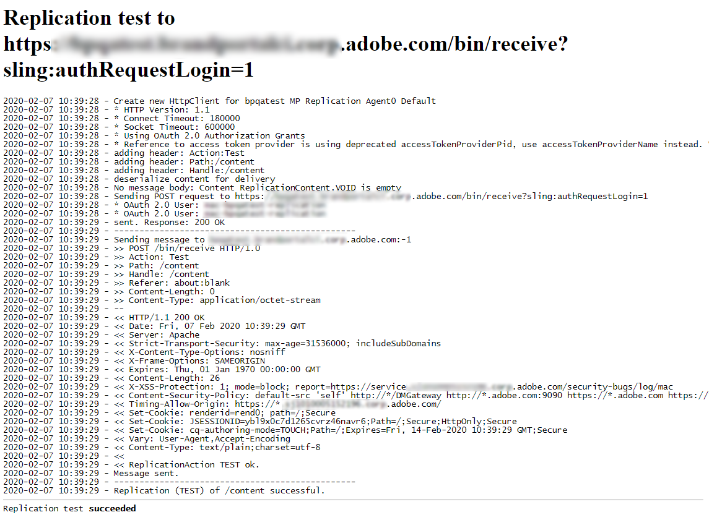
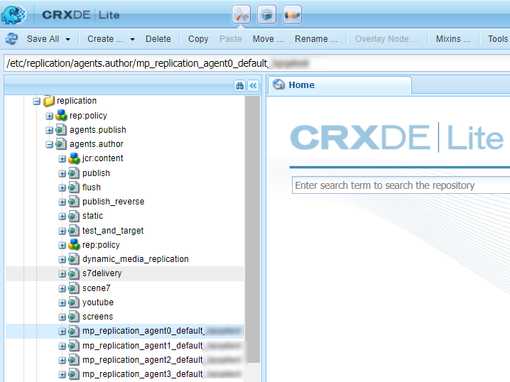

# Configure AEM Assets with Brand Portal {#configure-integration-64}

Adobe Experience Manager Assets is configured with Brand Portal through [!DNL Adobe I/O], which procures an IMS token for authorization of your Brand Portal tenant.

>[!NOTE]
>
>Configuring AEM Assets with Brand Portal via [!DNL Adobe I/O] is supported on AEM 6.4.8.0 and above.
>
>Earlier, Brand Portal was configured in Classic UI via Legacy OAuth Gateway, which uses the JWT token exchange to obtain an IMS Access token for authorization. 

>[!TIP]
>
>***For existing customers only*** 
>
>It is recommended to continue using existing legacy OAuth Gateway configuration. In case, you encounter problems with legacy OAuth Gateway configuration,  delete the existing configuration and create new configuration via [!DNL Adobe I/O].

This help describes the following two use-cases: 

* [New configuration](#configure-new-integration-64): If you are a new Brand Portal user and want to configure your AEM Assets author instance with Brand Portal, you can create new configuration on [!DNL Adobe I/O]. 
* [Upgrade configuration](#upgrade-integration-64): If you are an existing Brand Portal user with your AEM Assets author instance configured with Brand Portal on legacy OAuth Gateway, it is recommended to delete the existing configurations and create new configuration on [!DNL Adobe I/O].

The information provided is based on the assumption that anyone reading this Help is familiar with the following technologies:

* Installing, configuring, and administering Adobe Experience Manager and AEM packages

* Using Linux and Microsoft Windows operating systems

## Prerequisites {#prerequisites}

You require the following to configure AEM Assets with Brand Portal:

* An up and running AEM Assets author instance with latest Service Pack.
* Brand Portal tenant URL.
* A user with system administrator privileges on the IMS organization of the Brand Portal tenant. 

[Download and install AEM 6.4](#aemquickstart)

[Download and install latest AEM Service Pack](#servicepack)

### Download and install AEM 6.4 {#aemquickstart}

It is recommended to have AEM 6.4 to set up an AEM author instance. If you do not have AEM up and running, download it from the following locations:

* If you are an existing AEM customer, download AEM 6.4 from [Adobe Licensing website](http://licensing.adobe.com).

* If you are an Adobe partner, use [Adobe Partner Training Program](https://adobe.allegiancetech.com/cgi-bin/qwebcorporate.dll?idx=82357Q) to request AEM 6.4.

After you download AEM, for instructions to set up an AEM author instance, see [deploying and maintaining](https://helpx.adobe.com/experience-manager/6-4/sites/deploying/using/deploy.html#defaultlocalinstall).

### Download and install AEM latest Service Pack {#servicepack}

For detailed instructions see, 

* [AEM 6.4 Service Pack Release Notes](https://helpx.adobe.com/experience-manager/6-4/release-notes/sp-release-notes.html)

**Contact Customer Support** if you are unable to find the latest AEM package or Service Pack.

## Create configuration {#configure-new-integration-64}

Perform the following steps in the listed sequence if you are configuring AEM Assets with Brand Portal for the first-time: 

1. [Obtain public certificate](#public-certificate)
1. [Create [!DNL Adobe I/O] integration](#createnewintegration) 
1. [Create IMS Account configuration](#create-ims-account-configuration)
1. [Configure cloud service](#configure-the-cloud-service)
1. [Test configuration](#test-integration)

>[!NOTE]
>
>An AEM Assets author instance shall only be configured with one Brand Portal tenant.

### Create IMS configuration {#create-ims-configuration}

IMS configuration authenticates your Brand Portal tenant with AEM Assets author instance. 

IMS configuration includes two steps:

* [Obtain public certificate](#public-certificate) 
* [Create IMS Account configuration](#create-ims-account-configuration)

### Obtain public certificate {#public-certificate}

Public certificate allows you to authenticate your profile on [!DNL Adobe I/O].

1. Login to your AEM Assets author instance
Default URL: http:// localhost:4502/aem/start.html
1. From **Tools**  panel, navigate to **[!UICONTROL Security]** >> **[!UICONTROL Adobe IMS Configurations]**.

   

1. Adobe IMS Configurations page opens.
   
   Click **[!UICONTROL Create]**. 
   
   This will take you to the **[!UICONTROL Adobe IMS Technical Account Configuration]** page.

1. By default, **Certificate** tab opens.

   In **Cloud Solution**, select **[!UICONTROL Adobe Brand Portal]**.  

1. Mark the checkbox **[!UICONTROL Create new certificate]** and specify an **alias** for the certificate. The alias serves as name of the dialog. 

1. Click **[!UICONTROL Create certificate]**. A dialog appears. Click **[!UICONTROL OK]** to generate the public certificate.

   

1. Click **[!UICONTROL Download Public Key]** and save the *AEM-Adobe-IMS.crt* certificate file on your machine. The certificate file is used to [create [!DNL Adobe I/O] integration](#createnewintegration).  

   

1.  Click **[!UICONTROL Next]**. 

    In the **Account** tab, you create the Adobe IMS Account but for that you will need the integration details. Keep this page open for now.

    Open a new tab and [Create [!DNL Adobe I/O] integration](#createnewintegration) to get the integration details for IMS Account configurations. 

### Create [!DNL Adobe I/O] integration {#createnewintegration}

[!DNL Adobe I/O] integration generates API Key, Client Secret, and Payload (JWT) which is required in setting up the IMS Account configurations.

1. Login to [!DNL Adobe I/O] Console with system administrator privileges on the IMS organization of the Brand Portal tenant.

   Default URL: [https://console.adobe.io/](https://console.adobe.io/) 

1. Click **[!UICONTROL Create Integration]**.

1. Select **[!UICONTROL Access an API]**, and click **[!UICONTROL Continue]**.

   

1. Create a new integration page opens. 

   Select your organization from the drop-down list.

   In **[!UICONTROL Experience Cloud]**, Select **[!UICONTROL AEM Brand Portal]** and click **[!UICONTROL Continue]**. 

   If the Brand Portal option is disabled for you, ensure that you have selected correct organization from the drop-down box above the **[!UICONTROL Adobe Services]** option. If you do not know your organization, contact your administrator.

   

1. Specify a name and description for the integration. Click **[!UICONTROL Select a File from your computer]** and upload the `AEM-Adobe-IMS.crt` file downloaded in the [obtain public certificates](#public-certificate) section.

1. Select the profile of your organization. 

   Or, select the default profile **[!UICONTROL Assets Brand Portal]** and click **[!UICONTROL Create Integration]**. The integration is created.

1. Click **[!UICONTROL Continue to integration details]** to view the integration information. 

   Copy the **[!UICONTROL API Key]** 
   
   Click **[!UICONTROL Retrieve Client Secret]** and copy the Client Secret key.

   

1. Navigate to **[!UICONTROL JWT]** tab, and copy the **[!UICONTROL JWT payload]**.

   The API Key, Client Secret key, and JWT payload information will be used to create IMS account configuration.

### Create IMS Account configuration {#create-ims-account-configuration}

Ensure that you have performed the following steps:

* [Obtain public certificate](#public-certificate)
* [Create [!DNL Adobe I/O] integration](#createnewintegration)

**Steps to create IMS account configuration:**

1. Open the IMS Configuration page, **[!UICONTROL Accounts]** tab. You kept the page open at the end of section, [Obtain public certificate](#public-certificate).

1. Specify a **[!UICONTROL Title]** for the IMS account.

   In **[!UICONTROL Authorization Server]**, enter the URL: [https://ims-na1.adobelogin.com/](https://ims-na1.adobelogin.com/)  

   Paste the API Key, Client Secret, and JWT payload that you have copied in the end of [Create [!DNL Adobe I/O] integration](#createnewintegration).

   Click **[!UICONTROL Create]**.

   The Integration is created.

   

1. Select the IMS configuration and click **[!UICONTROL Check Health]**. A dialog box appears. 

   Click **[!UICONTROL Check]**. On successful connection, the *Token retrieved successfully* message appears.

   

>[!CAUTION]
>
>You must have only one IMS configuration. Do not create multiple IMS configurations.
>
>Ensure that the IMS configuration passes the health check. If the configuration does not pass the health check, it is invalid. You must delete it and create a new, valid configuration.

### Configure cloud service {#configure-the-cloud-service}

Perform the following steps to create Brand Portal cloud service configuration:

1. Login to your AEM Assets author instance

   Default URL: http:// localhost:4502/aem/start.html
1. From **Tools**  panel, navigate to **[!UICONTROL Cloud Services >> AEM Brand Portal]**.

   Brand Portal Configurations page opens.

1. Click **[!UICONTROL Create]**.

1. Specify a **[!UICONTROL Title]** for the configuration. 

   Select the IMS Configuration that you have created in the step, [create IMS Account configuration](#create-ims-account-configuration).
   
   In **[!UICONTROL Service URL]**, enter your Brand Portal tenant URL.   
   
    

1. Click **[!UICONTROL Save and Close]**. The cloud configuration is created. Your AEM Assets author instance is now integrted with the Brand Portal tenant. 

### Test configuration {#test-integration}

1. Login to your AEM Assets author instance

   Default URL: http:// localhost:4502/aem/start.html

1. From **Tools**  panel, navigate to **[!UICONTROL Deployment >> Replication]**.

    

1. Replication page opens. 

   Click **[!UICONTROL Agents on author]**.

   

1. Four replication agents are created for each tenant. 

   Locate the replication agents of your Brand Portal tenant. 
   
   Click the replication agent URL. 

   

   >[!NOTE]
   >
   >The replication agents work in parallel and share the job distribution equally, thereby increasing the publishing speed by four times the original speed. After the cloud service is configured, additional configuration is not required to enable the replication agents that are activated by default to enable parallel publishing of multiple assets.

1. To verify the connection between AEM Assets author and Brand Portal, click **[!UICONTROL Test Connection]**.

   

1. Look at the bottom of the test results to verify that the replication succeeded.

   

1. Verify the test results on all four replication agents one-by-one.

   >[!NOTE]
   >
   >Avoid disabling any of the replication agents, as it can cause the replication of some of the assets to fail.
   >
   >Ensure that all the four replication agents are configured to avoid timeout error. See [troubleshoot issues in parallel publishing to Brand Portal](https://docs.adobe.com/content/help/en/experience-manager-brand-portal/using/publish/troubleshoot-parallel-publishing.html#connection-timeout).

Brand Portal is successfully configured with your AEM Assets author instance. You can now:

* [Publish assets from AEM Assets to Brand Portal](../assets/brand-portal-publish-assets.md)
* [Publish folders from AEM Assets to Brand Portal](../assets/brand-portal-publish-folder.md)
* [Publish collections from AEM Assets to Brand Portal](../assets/brand-portal-publish-collection.md) 
* [Configure Asset Sourcing](https://docs.adobe.com/content/help/en/experience-manager-brand-portal/using/asset-sourcing-in-brand-portal/brand-portal-asset-sourcing.html) enabling the Brand Portal users to contribute and publish assets to AEM Assets. 

## Upgrade configuration {#upgrade-integration-64}

Perform the following steps in the listed sequence to upgrade existing configurations: 
1. [Verify running jobs](#verify-jobs)
1. [Delete existing configurations](#delete-existing-configuration)
1. [Create configuration](#configure-new-integration-64)

### Verify running jobs {#verify-jobs}

Ensure that no publishing job is running on your AEM Assets author instance before you make any modifications. For that, you can verify all four replication agents and ensure that the queue is ideal/empty.  

1. Login to your AEM Assets author instance

   Default URL: http:// localhost:4502/aem/start.html

1. From **Tools**  panel, navigate to **[!UICONTROL Deployment >> Replication]**.

1. Replication page opens. 

   Click **[!UICONTROL Agents on author]**.

   

1. Locate the replication agents of your Brand Portal tenant. 
   
   Ensure that the **Queue is Idle** for all the replication agents, no publishing job is active. 

   

### Delete existing configurations {#delete-existing-configuration}

You must run the following check-list while deleting the existing configuration.
* Delete all four replication agents
* Delete cloud service
* Delete MAC user 

Perform the following steps to delete the existing configuration:

1. Login to your AEM Assets author instance and open CRX Lite as an administrator.

   Default URL: http:// localhost:4502/crx/de/index.jsp

1. Navigate to `/etc/replications/agents.author` and delete all the four replication agents of your Brand Portal tenant.

   

1. Navigate to `/etc/cloudservices/mediaportal` and delete the **Cloud Service configuration**.

   

1. Navigate to `/home/users/mac` and delete the **MAC user** of your Brand Portal tenant.

   

You can now [create configuration](#configure-new-integration-64) on your AEM 6.4 author instance on [!DNL Adobe I/O]. 

<!--
   Comment Type: draft

   <li> </li>
   -->

   <!--
   Comment Type: draft

   <li>Step text</li>
   -->

After replication succeeds, you can publish assets, folders, and Collections to Brand Portal. For details, see:

* [Publish assets to Brand Portal](brand-portal-publish-assets.md)
* [Publish assets and folders to Brand Portal](brand-portal-publish-folder.md)
* [Publish Collections to Brand Portal](brand-portal-publish-collection.md)
