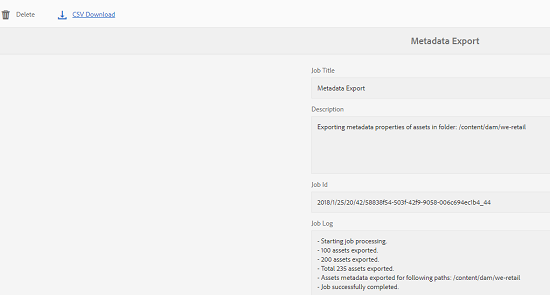

# Bulk metadata import and export {#bulk-metadata-import-and-export}

AEM Assets lets you import asset metadata in bulk using a CSV file. You can do bulk updates for the recently uploaded assets or the existing assets by importing a CSV file. You can also ingest asset metadata in bulk from third-party system in CSV format.

## Import metadata {#import-metadata}

The metadata import is asynchronous and does not impede the system performance. Simultaneous update of the metadata for multiple assets can be resource-intensive because of XMP writeback activity if workflow flag is checked. Plan such an import during lean server usage to prevent performance impact for other users.

>[!NOTE]
>
>To import metadata on custom namespaces, first register the namespaces.

To import metadata in bulk, follow these steps:

1. Navigate to the Assets user interface, and tap/click **[!UICONTROL Create]** from the toolbar.
1. From the menu, select **[!UICONTROL Metadata]**.
1. On the **[!UICONTROL Metadata Import]** page, tap/click the **[!UICONTROL Select File]**.  Select the CSV file with the metadata.
1. Ensure that the CSV file contains the following parameters:

    | Metadata import parameters | Description |
    |:---|:---|
    | [!UICONTROL Batch Size] | Number of assets in a batch for which metadata is to be imported. Default value is 50. Maximum value is 100. |
    | [!UICONTROL Field Separator] | Default value is `,` &ndash; a comma. You can specify any other character. |
    | [!UICONTROL Multi Value Delimiter] | Separator for metadata values. Default value is `|` &ndash; a pipe. |
    | [!UICONTROL Launch Workflows] | False by default. When set to true and default Launcher settings are in effect for the `DAM Metadata WriteBack Workflow` (that writes metadata to the binary XMP data). Enabling launch workflows has a performance impact on the system. |
    | [!UICONTROL Asset Path Column Name] | Defines the column name for the CSV file with assets. |

1. Tap/click **[!UICONTROL Import]** from the toolbar. After the metadata is imported, a notification is sent to your Notification inbox. Navigate to asset property page and verify whether the metadata values are correctly imported for assets.

To add date and timestamp when importing metadata, use `YYYY-MM-DDThh:mm:ss.fff-00:00` format for date and time. Date and time are separated by `T`, `hh` is hours in 24-hour format, `fff` is nanoseconds, and `-00:00` is timezone offset. For example, `2020-03-26T11:26:00.000-07:00` is March 26, 2020 at 11:26:00.000 AM PST time.

>[!CAUTION]
>
>If the date format does not match `YYYY-MM-DDThh:mm:ss.fff-00:00`, the date values are not set. The date formats of exported metadata CSV file is in the format `YYYY-MM-DDThh:mm:ss-00:00`. If you want to import it, convert it to the acceptable format by adding the nanoseconds value denoted by `fff`.

## Export Metadata {#export-metadata}

A few use cases for exporting metadata in bulk are:

* Import the metadata in a third-party system when migrating assets.
* Share asset metadata with a wider project team.
* Test or audit the metadata for compliance.
* Externalize the metadata for separate localization.

You can export metadata for multiple assets in a CSV format. The metadata is exported asynchronously and does not impact the performance of the system. To export metadata, AEM traverses through the properties of the asset node `jcr:content/metadata` and its child nodes and exports the metadata properties in a CSV file.

To export metadata of multiple assets in bulk, follow these steps:

1. Select the asset folder that contains assets for which you want to export metadata. From the toolbar, select **[!UICONTROL Export metadata]**.

1. In the [!UICONTROL Metadata Export] dialog, specify a name for the CSV file. To export metadata for assets in subfolders, select **[!UICONTROL Include assets in sub-folders]**.

   

1. Select the desired options. Provide a filename and if necessary a date.
1. In the **[!UICONTROL Properties to be exported]**, specify whether you want to export all or specific properties. If you choose **[!UICONTROL Selective]** properties to be exported, add the desired properties.

1. From the toolbar, tap/click **[!UICONTROL Export]**. A message confirms that the metadata is exported. Close the message.

1. Open the inbox notification for the export job. Select the job and click **[!UICONTROL Open]** from the toolbar. To download the CSV file with the metadata, tap/click **[!UICONTROL CSV Download]** from the toolbar. Click **[!UICONTROL Close]**.

   
