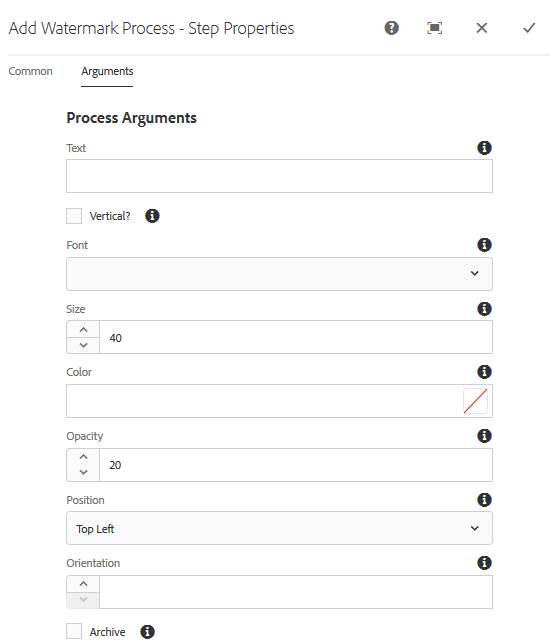

# Watermark your digital assets {#watermarking}

[!DNL Adobe Experience Manager Assets] allows you to add a digital watermark to assets that helps users verify the authenticity and copyright ownership of the assets. [!DNL Experience Manager Assets] supports text to be used as a watermark on PNG and JPEG files.

Adobe Experience Manager (AEM) Assets lets you add a digital watermark to images that helps users verify the authenticity and copyright ownership of the assets. AEM Assets supports text to be used as a watermark on PNG and JPEG files.

To be able to apply watermark on assets, add the watermarking step in the [!UICONTROL DAM Update Asset] workflow.

1. Access the [!DNL Experience Manager] user interface, and go to **[!UICONTROL Tools]** &gt; **[!UICONTROL Workflow]** &gt; **[!UICONTROL Models]**.
1. From the Workflow Models page, select the **[!UICONTROL DAM Update Asset]** workflow and click **[!UICONTROL Edit]**.  

1. From the side panel, drag the **[!UICONTROL Add Watermark]** step and add it to the [!UICONTROL DAM Update Asset] workflow.

   

   >[!NOTE]
   >
   >Place the [!UICONTROL Add Watermark] step anywhere before the [!UICONTROL Process Thumbnail] step.

1. Open the **[!UICONTROL Add Watermark]** step to display its properties.
1. In the **[!UICONTROL Arguments]** tab, specify valid values in the various fields, including text, font type, size, color, position, orientation, and so on. To confirm the changes, click **[!UICONTROL Done]**.

   

1. Save the **[!UICONTROL DAM Update Asset]** workflow with the [!UICONTROL Watermark] step.
1. From the AEM user interface, upload a sample asset. The watermark appears with the font size, color and so on, at the position that you configured in the above steps.

To watermark PDF documents programmatically or with dynamic information, consider using [AEM Document Services](/help/forms/using/overview-aem-document-services.md) offering.

## Tips and limitations {#tips-limitations}

* Only text-based watermarks are supported. Images are not used as watermarks, even though you can upload images when creating the [!UICONTROL Add Watermark Process].
* Only PNG and JPEG files are supported to be watermarked. Other asset formats are not watermarked.
