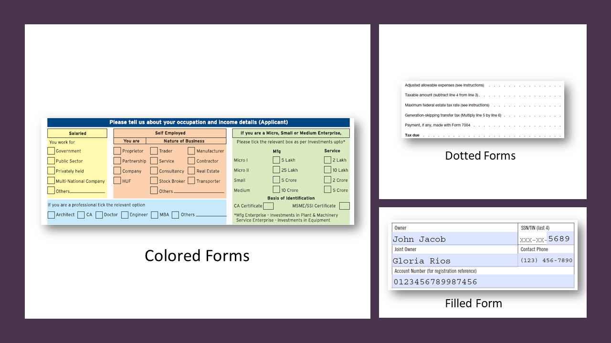
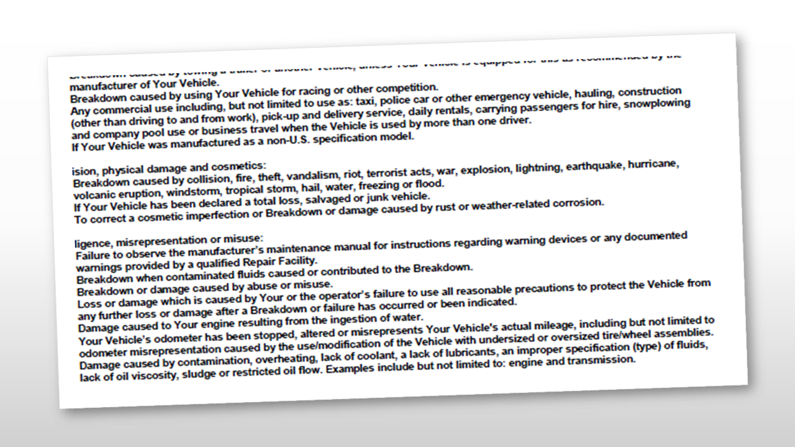
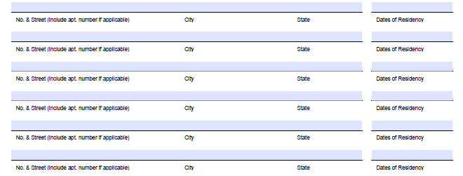
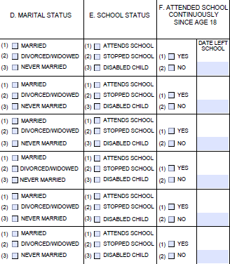
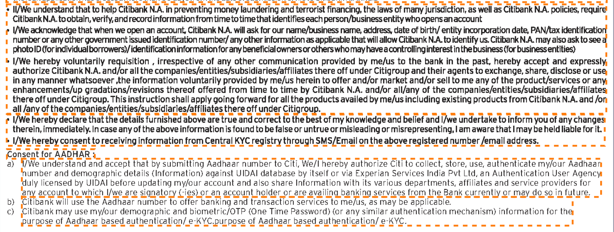
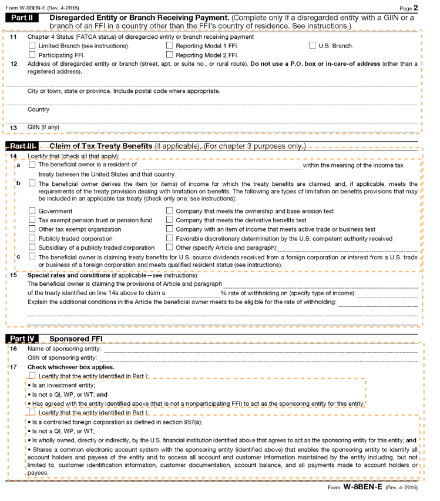

# Known patterns and styles{#known-patterns-and-styles}

AEM Forms Automated Conversion service converts a PDF form to an adaptive form. The service uses artificial intelligence and machine learning algorithms to understand the layout and fields of the source form. Every machine learning service continuously learns from source data and produces an improved output with every churn. These services learn from the experience like humans.

Automated Forms Conversion service is trained on a large set of forms. It easily identifies fields in a source form and produces adaptive forms. However, there are some fields and styles in PDF forms which are easily visible to the human eye but difficult to understand for the service. The service can assign different than applicable field types or panels to some fields or styles. All such field and style patterns are listed below.

The service would start identifying and assigning correct fields or panels to these patterns as it keeps learning from the source data. For the time being, you can use [Review and Correct](../../../forms/using/wip/review-correct-ui-edited.md) editor to fix such issues. Before start fixing the issues or reading further, familiarize yourself with [adaptive form components](../../../forms/using/introduction-forms-authoring.md).

## Style and layout {#style-and-layout}

 
Service may not convert or partially convert PDF forms with a dotted outline, colored fields, or filled forms to adaptive forms. 

 

 
Service does not support scanned forms or PDF forms with content in the form of an image.

 

 
Service can leave some texts with very small fonts or very less width in between lines unidentified. To identify such texts, add space between the lines and increase the font size of such texts and re-convert the forms. 

 

## Choice Group {#choice-group}

 
Service may not or partially recognize nested choice groups

 
Choice groups with only box or circular shapes are supported. Choice groups with any other shape are not converted to corresponding adaptive form components 

 
Item Title

 
Item Title

 
Item Title

## Fields and widgets {#fields-and-widgets}

 
Service can leave some form fields without borders unidentified

 

 
Service can leave some form fields with captions at the bottom or right unidentified

 

 
Service does not support hidden fields

 <video imageRotate="0" status="changing" videoLocalizationType="subtitle" videoSrcUrl="/content/dam/help/en/experience-manager/6-4/forms/using/wip/styles-and-pattern--considerations-and-best-practices-/jcr_content/main-pars/image/hidden-fields.mp4"></video>

 
Service can merge the form fields which are very near to each other or assign a wrong type to such fields

 
Service may not recognize fields without explicit labels

 

 
Service may not recognize fields with far away captions

## Image {#image}

 
Service does not identify images. Manually add images to converted forms

 
Service does not extract text present within an image. 

 
Item Title

 
Item Title

 
Item Title

## List {#list}

 
Lists containing form fields are not supported

 

 
Service can leave a few nested lists unidentified 

 
Service can merge some closely spaced list items with each other

 
Service can merge lists containing choice groups with each other

 

 
Item Title

## Table {#table}

 
Some borderless tables are not converted to adaptive form tables

 

 
Service does not convert nested tables to adaptive form tables

 
Service may not convert some colored tables, large-empty table, and merged tables to adaptive form tables. Service easily converts simple tables, with empty fields, proper headers, and clear boundaries and borders to adaptive form tables.

 

 
Tables with placeholder values are not converted to adaptive form tables

<!--
Comment Type: draft

<h2>Text</h2>
-->

 
Very small fonts with densely packaged content are not recognized

 

 
Item Title

 
Item Title

 
Item Title

 
Item Title

<!--
Comment Type: draft

<h4>Scanned PDF Forms, PDF Forms with the dynamic layout, dotted outline, and filled or colored fields are not supported.</h4>
-->

<!--
Comment Type: draft

<ul>
<li>Scanned PDF Forms, PDF Forms with the dynamic layout, dotted outline, and filled or colored fields are not supported.  </li>
</ul>
-->

<!--
Comment Type: draft

<ul>
<li>Forms with very small fonts or content with very less width in between lines are not converted properly. Add spacing between the lines and increase the size of forms before starting the conversion.</li>
</ul>
-->

<!--
Comment Type: draft

<ul>
<li>Forms with very small fonts or content with very less width in between lines are not converted properly. Add spacing between the lines and increase the size of forms before starting the conversion.</li>
<li>Images and text inside the images are not identified. Manually add images to converted forms.  </li>
<li>Complex tables like borderless tables, nested tables, table with colored rows, and tables with placeholder values are not converted to adaptive form tables. Only simple table, with empty fields, proper headers, and clear boundaries and borders are supported. You can use <a href="https://chl-author-preview.corp.adobe.com/content/help/en/experience-manager/6-4/forms/using/wip/review-correct-ui-edited.html#main-pars_header_1182718738">adaptive form editor</a> to add or modify complex tables, after the conversion.</li>
</ul>
-->

<!--
Comment Type: draft

<h2>Field-level patterns and styles</h2>
-->

<!--
Comment Type: draft

<h3>Lists</h3>
-->

<!--
Comment Type: draft

<table border="1" cellpadding="1" cellspacing="0" width="100%">
<tbody>
<tr>
<td valign="top" width="204">
Pattern
 </td>
<td>Resolution</td>
<td>Example</td>
</tr>
<tr>
<td>Closely spaced list items are merged.</td>
<td>Ensure there is proper spacing in the list items.</td>
<td></td>
</tr>
<tr>
<td>Lists with fields are not supported</td>
<td>Use Review and Correct editor to identify such fields</td>
<td> </td>
</tr>
<tr>
<td> </td>
<td> </td>
<td> </td>
</tr>
</tbody>
</table>
-->

<!--
Comment Type: draft

<h3>Tables</h3>
-->

<!--
Comment Type: draft

<h3>Choice groups</h3>
-->

<!--
Comment Type: draft

<ul>
<li>Lists with form fields, nested lists, and nested choice groups are not supported.</li>
<li>Form fields with captions at bottom or right are not supported.</li>
<li>Form fiields without bordes are not supported.</li>
<li>Hidden form fields are not supported.</li>
<li>Button in PDF forms are not converted to adaptive form buttons.  </li>
<li>Tables with clear explicit boundaries and borders are supported.</li>
<li>Fields with far away captions are not supported.  </li>
<li>Choice groups with only box or circle shaped selectors are supported. </li>
</ul>
-->

