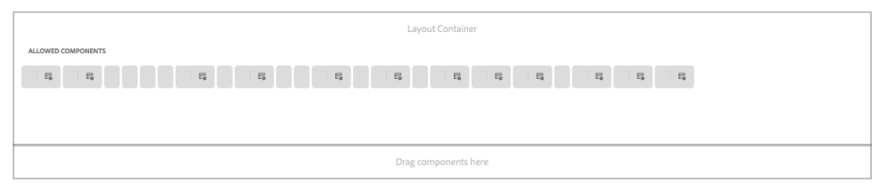

# AEM 6.4 Cumulative Fix Pack Release Notes {#aem-cumulative-fix-pack-release-notes}

## Release Information {#release-information}

| Products |**Adobe Experience Manager (AEM) 6.4** |
|---|---|
| Version |6.4.8.2 |
| Type |Cumulative Fix Pack |
| Date |September 03, 2020 |
| Prerequisite |[AEM 6.4 Service Pack 8 (6.4.8.0)](sp-release-notes.md) |
| Download URL | AEM 6.4.8.2 on [Software Distribution](https://experience.adobe.com/#/downloads/content/software-distribution/en/aem.html?package=/content/software-distribution/en/details.html/content/dam/aem/public/adobe/packages/cq640/cumulativefixpack/aem-6.4.8-cfp-2.0.zip) |

## What's included in AEM 6.4.8.2 {#what-s-included-in-aem}

AEM Cumulative Fix Pack 6.4.8.2 is an important update that includes several internal and customer fixes since the general availability of AEM 6.4 Service Pack 8 (6.4.8.0) in March 2020.

AEM 6.4.8.2 is a Cumulative Fix Pack (CFP) that is dependent on AEM 6.4 Service Pack 8. Install the CFP after installing AEM 6.4 Service Pack 8.

In AEM 6.4.8.2, the built-in repository (Apache Jackrabbit Oak) is updated to version 1.8.22.

For information on CFP and other types of releases, see [AEM Update Release Vehicle Definitions](../sites-deploying/update-release-vehicle-definitions.md)

Adobe Experience Manager 6.4.8.2 provides fixes for the following issues.

### Sites {#sites-6482}

* If the `RolloutConfigManagerFactoryImpl` is not able to load a rollout config, it does not attempt to load the missing configs. It returns the cached configurations (NPR-34091).
* In Text core component, after using source HTML edit option, the class from `em` tag is removed (NPR-34080).
* When you upgrade from Experience Manager 6.2 to Experience Manager 6.5, the Parsys component of static templates do not display correctly. The height of the the Parsys component is set to 0 and the components inside it are not visible (NPR-34044).
* The label information is not displayed of the allowed components inside of the Template Editor (NPR-33908).

  

* Users are not able to add or edit components to the parsys after the fourth-level of nested components (NPR-33873).
* If the initial content of an editable template is changed and then the template is published, any new pages created with this template show the Published date of the template even though the pages are not published (NPR-33822).
* The `cq:acLinks` and `cq:acUUID` properties for [!DNL Adobe Campaign] on the copy are removed during copy and paste operation (NPR-33793).
* In the [!UICONTROL Live Usage] tab, only 49 results are displayed. It does not show all the usage for the component (NPR-33710).
* A webpage with `/` character in the URL becomes unresponsive while authoring. When a component is added while authoring, the CPU usage increases and browser stops responding (NPR-33625).
* In inline editing mode in [!DNL RTE], dragging an image does not work for Text component (NPR-33579).
* It is possible to create a component in a blueprint page with the same name as the page name. During rollout, such a component is renamed by suffixing `_msm_moved`. However, the component is moved to the end of the [!UICONTROL Paragraph System] (NPR-33534).
* Launch promotion does not publish pages when [!UICONTROL include subpages] property is not checked on the first content root (NPR-33533).
* Redirection to [!DNL Experience Manager] page with anchor does not work on Author instance as `PageRedirectServlets` puts query string after a URL fragment or an anchor (NPR-34287).
* `PageRedirectServlet` appends `.html` after Sling mapping leading to link failures (NPR-34271).
* You can suspend the [!DNL Live Copy] of a page and inheritance are broken in as seen in the Editor mode. However, in the Page properties, the icon representing inheritance incorrectly indicates that the inheritance exists and is not broken (NPR-34096).
* Issue with display of allowed components in Edit template page (CQ-4297295).
* After upgrading Chrome and Firefox, the pop-up menus are not working as expected. On loading the page properties, it does not display the panel when there is data in it (CQ-4292995).

### Assets {#assets-6482}

* Text extraction for the uploaded PDF files does not work and full-text search for some words in a PDF file fail to fetch that PDF file (NPR-34165).

  >[!NOTE]
  >To make this fix work, restart your Adobe Experience Manager instance after installing the Service Pack 6.4.8.2.

* Backslashes are added before special characters in search suggestions of assets, which have special characters in their name (NPR-33833).

* The custom filters that are saved as smart collections are not correctly applied to assets, therefore the search results are not accurate   (NPR-33725).

* Timeline of an asset within a folder that was reordered depicts that the asset was moved (NPR-33580).

* Unpublishing the assets in bulk from [!DNL Brand Portal] leads to `Request-URI Too Long` error  (NPR-34158).

* In column view if user selects [!UICONTROL Filter] option after selecting a set of assets (the assets get deselected), and then selects a different set of assets to move then the previously selected assets are also moved to the new location (NPR-34018).

* Scroll bar is not visible in list view, even if there are numerous assets to fit in the page (NPR-34156).

* The [!UICONTROL Manage Publication] page for assets is broken and the options therein are not working (CQ-4302509).

**Dynamic Media**

* The Smart Crop functionality fails with error when image profile is added to a folder having multiple (for example, 11) aspect ratios (NPR-34083).

* Changes to image presets in [!UICONTROL Adobe Experience Manager] do not sync to Scene7 Publishing System (NPR-34284, CQ-4299713).

* The [!UICONTROL PANORAMICVIEW_AUTOROTATE] modifier label is missing from the [!UICONTROL Behavior] tab in [!UICONTROL Viewer Preset Editor] page (CQ-4302043).

### Platform {#platform-6482}

* The default values for the **[!UICONTROL Connect Timeout]** and **[!UICONTROL Socket Timeout]** settings for the Default Agent (publish) configuration are not specified (NPR-33708).
* The maintenance task scheduler starts and stops maintenance tasks too often than configured (NPR-33520).
* Cannot download logs using the Diagnosis tool on an upgraded Experience Manager instance (NPR-34419).

### Integrations {#integrations-6482}

* The value of `library_path` is not considered when generating [!DNL Adobe Launch] library URL for libraries migrated from [!DNL Adobe Dynamic Tag Management]. Also, the migrated libraries use a different prefix than [!DNL Adobe Launch] libraries. (NPR-34238).
* The properties inherited from a cloud service do not persist on updating the page properties (NPR-33865).

### User Interface {#ui-6482}

* The display of count of selected assets on a search page is incorrect (NPR-33540).

### Communities {#communities-6482}

* The existing users of a community group added through admin console are removed from the user list on any modification in the community group console (NPR-34312).

### Forms {#forms-6482}

>[!NOTE]
>
>[!DNL Experience Manager] Cumulative Fix Pack does not include fixes for [!DNL Experience Manager Forms]. They are delivered using a separate [!DNL Forms] add-on package. In addition, a cumulative installer is released that includes fixes for [!DNL Experience Manager Forms] on JEE. For more information, see [Install AEM Forms add-on package](#install-aem-forms-add-on-package) and [Install AEM Forms JEE installer](#install-aem-forms-jee-installer).

**Adaptive Forms**

* When there is a missing adaptive form fragment, the adaptive form fails to render (NPR-34303).

* Help content description for an adaptive form fields display a paragraph HTML tag (NPR-34117).

* When you add a Forms container on an [!DNL Experience Manager Sites] page, the page displays the following error message and does not allow you to add any new components (NPR-33858):

   `DevTools failed to load SourceMap: Could not load content for <Link>. HTTP error: status code 404, net::ERR_HTTP_RESPONSE_CODE_FAILURE`

* When you select the **[!UICONTROL Revalidate on Server]** property and upload multiple attachments, the adaptive form fails to submit (NPR-33701).

* When you select the **[!UICONTROL Use Page Language]** and **[!UICONTROL Form covers entire width of the Page]** options in [!DNL Experience Manager Forms] component on an [!DNL Experience Manager Sites] page, the page fails to translate (NPR-33641).

* When you submit an analytics-enabled adaptive form embedded in an [!DNL Experience Manager Sites] page, analytics does not work correctly (NPR-31359).

* Removed dependencies on [!DNL Lodash] and [!DNL backbone] libraries (NPR-33458).

* The **[!UICONTROL Submit to REST endpoint]** submit action does not work for an adaptive form (NPR-34513).

* Accessibility: When you try to submit an adaptive form without uploading an attachment for a mandatory field, the focus does not shift to the attachment field automatically (NPR-34511).

**Workflow**

* [!DNL Experience Manager] Workflow Purge operation fails and displays the following error message (NPR-33576):

   `java.lang.UnsupportedOperationException: The query read more than 500000 nodes in memory`

* When you install [!DNL Experience Manager] 6.4.8.1, the [!UICONTROL To Do] list of items does not display as links. The text for the [!UICONTROL To Do] items include HTML tags (NPR-34318).

**BackendIntegration**

* Unable to configure a form data model in an AWS hosted [!DNL Experience Manager Forms Linux] environment (NPR-33617).

**Designer**

* When [!DNL Acrobat DC] is installed on an [!DNL Experience Manager] Forms server, the **[!UICONTROL Distribute Form]** option is not available in [!DNL Experience Manager Designer] version 6.x (NPR-34325).

**Document Security**

* Unable to execute the Sign operation with HSM-based certificates in a PDF file after installing [!DNL Experience Manager] 6.4.8.0 (NPR-34309).

**Upgrade**

* When you upgrade the [!DNL JBoss] version to 7.0.9 for [!DNL Experience Manager Forms] with Document Security in a [!DNL Linux] environment, it results in an error (CQ-4300546).

For information on security updates, see [Experience Manager security bulletins page](https://helpx.adobe.com/security/products/experience-manager.html).

## Hotfixes and Feature Packs included in previous Cumulative Fix Packs {#hotfixes-and-feature-packs-included-in-previous-cumulative-fix-packs}

### Adobe Experience Manager 6.4.8.1 {#experience-manager-6481}

AEM Cumulative Fix Pack 6.4.8.1 is an important update that includes several internal and customer fixes since the general availability of AEM 6.4 Service Pack 8 (6.4.8.0) in March 2020.

AEM Cumulative Fix Pack 6.4.8.1 is dependent on AEM 6.4 Service Pack 8. Therefore, you must install the AEM Cumulative Fix Pack 6.4.8.1 package after installing AEM 6.4 Service Pack 8.

Some of the key highlights of AEM 6.4.8.1 are:

* Anonymous access to CRXDE Lite is disallowed to enhance security. Instead, the users are directed to the login screen. See [developing with CRXDE Lite](/help/sites-developing/developing-with-crxde-lite.md).
* Removed Package Share integration with Adobe Experience Manager.
* The built-in repository (Apache Jackrabbit Oak) is updated to version 1.8.21.

For information on CFP and other types of releases, see [AEM Update Release Vehicle Definitions](../sites-deploying/update-release-vehicle-definitions.md)

Adobe Experience Manager 6.4.8.1 provides fixes to the following issues.

#### Sites {#sites-6481}

* When the name of a local component in a LiveCopy is identical to the name of a component in the blueprint and the component is rolled out from blueprint, term _msm_moved is not added to the name of the local component (NPR-33207).
* The parameters appended to the original request are not included in the redirect URL (NPR-33174).
* When the Coral.Select option sets emptyOption=true or contains a default item with value = "", the dropdownshowhide.js file encounters an error: Uncaught TypeError: component.getValue is not a function (NPR-33163).
* When a component includes another component as data-sly-resource, the parent container component placeholder is replaced with the inner components placeholder (NPR-33119).
* When you base a Content Fragment on a schema and it contains a mandatory text area or a path field, the Content Fragment fails to save (NPR-33007)
* When you create a custom component using the Out-of-the-box experience fragment component and use it in AEM Sites pages, AEM does not display references (usage) for the custom component (NPR-32852).
* When an AEM Sites page is part of a large content set with multiple live-copies, the page version history preview fails to load (NPR-32772).
* When you promote a launch it adds the "cq:LiveRelationship" mixin to every component added in the launch. It impacts all the launches irrespective of if a launch is created with or without selecting the —  Inherit source page live data —  option (NPR-32664).
* When pagination starts, Experience Fragments Picker does not load all the items (NPR-32605).
* Unable to create a launch for an AEM Sites page. Launch creation results in an error (NPR-32544).
* Manage Publication does not include referenced assets in the request for activation workflow (NPR-32463).
* Dispatcher health check displays `Invalid cookie header` warning message in the log files (NPR-33630).
* Salesforce integration is vulnerable to SSRF (NPR-32671).
* Reflected XSS in PreferencesServlet (NPR-33439).

#### Assets {#assets-6481}

* The count of assets does not change as per the change in selection in List View (NPR-33285).

* Next button is not enabled on selecting parent node (where single child folder is visible) and then selecting child folder (NPR-33284).

* Touch UI fails to render (with error) for users who don’t have read access on repository root, when DMS7 or Hybrid mode is enabled (NPR-33175).

* The GB18030 characters occurring in folder and asset names change to blank in the downloaded zip files (NPR-33150).

* Extra folder is created on smart-cropping an asset that is inside a parent folder with dot `.` character in its name (NPR-32755).

* Lazy loading is not triggered and not more than 100 assets are displayed on selecting to review the tasks from notifications inbox (NPR-32749).

* Link page to share collection is broken due to change in coral-info (NPR-32510).

* Asset processing while bulk upload gets stuck (CQ-4293916).

* SSRF vulnerability in Experience Manager (NPR-33437).

#### Platform {#platform-6481}

* The [!DNL Sling] filter is not called if the `sling:match` map entry is created under `/etc/maps` (NPR-33308).
* All flush agents are triggered on deactivating a page (NPR-32941).
* When you use the `ScriptProcessor` API to minify a JavaScript library, the log file displays an error message indicating that the JavaScript code is not compliant to strict mode. The API does not provide option to enable or disable strict mode. (NPR-32746).
* When an SQL query runs for a longer time, for example 7 hours, AEM stops responding (NPR-33043).

#### User Interface {#ui-6481}

* When you search or browse a path using a selection dialog, the selection dialog displays all contents of the selected JCR node instead of  displaying only the images (NPR-32712).

#### Translation Projects {#tranlation-6481}

* A `NullPointerException` error is seen in the logs on running a translation job (NPR-32220).

#### Integrations {#integrations-6481}

* Cross-site scripting for JSON (NPR-32745).

#### Communities {#communities-6481}

* Authors, after creating a new group, are not redirected to the [!UICONTROL Community Group] section on [!DNL Internet Explorer] 11 (NPR-33202).
* An error occurs on accessing the [!UICONTROL Activity Stream] page (NPR-33152).
* Editing a [!DNL Communities] group and changing the thumbnail image does not update the group thumbnail image (NPR-32603).
* While creating a version of notifications and subscriptions of User Generated Content (UGC), an incorrect ID of the source page is stored (CQ-4289703).
* Cross-site scripting issue (NPR-33212).

#### Workflow {#workflow-6481}

* Some components do not display on the dialog box that pops-up when a user completes a workflow that includes a [!UICONTROL Dialog Participant step] (NPR-32989).

* The [!UICONTROL Timeline] option in the left rail takes more time to load than expected (NPR-32850).

#### Forms {#forms-6481}

>[!NOTE]
>
>AEM Cumulative Fix Pack does not include fixes for AEM Forms. They are delivered using a separate Forms add-on package. In addition, a cumulative installer is released that includes fixes for AEM Forms on JEE. For more information, see [Install AEM Forms add-on package](#install-aem-forms-add-on-package) and [Install AEM Forms JEE installer](#install-aem-forms-jee-installer).

* Correspondence Management: When a user pastes content from a [!DNL Word] document, the text document fragment does not retain formatting (NPR-33213).
* Adaptive Forms: A new line to a string in an adaptive forms dictionary adds `&#xa;` characters to the dictionary (NPR-33265).
* Adaptive Forms: The user is not able to save an adaptive form with more than one attachment (NPR-33214).
* Adaptive Forms: `AddInstance` and `RemoveInstance` methods for Instance Manager class do not add dynamic number of instances for lazy load fragments on [!DNL Internet Explorer 11] (NPR-33201).
* Adaptive Forms: Analytics enabled on an adaptive form embedded in a [!DNL Sites] page do not record data for Submit and Abandon events (NPR-31359).
* Adaptive Forms: When a user pastes the content from a [!DNL Word] document to an adaptive form and submit it, the submitted adaptive form includes unicode characters. In addition, the PDF to PDF/A conversion fails due to unicode characters (NPR-33348).
* BackendIntegration: Form data model requests fail as the refresh token expires due to incorrect inactive state (NPR-33168).
* Document Services: Convert PDF service fails to convert PDF documents to PostScript due to missing Gibson jars for [!DNL WebLogic] on the [!DNL Linux] server (NPR-33515, CQ-4292239).
* Document Services: When a user converts a text file to a PDF, Japanese characters do not render correctly (NPR-33239).
* Stored XSS with the GuideSOMProviderServlet (NPR-32701).

## Install 6.4.8.2 {#install}

### Setup requirements {#setup-requirements}

<!--

>[!NOTE]
>
>For successful installation of AEM 6.4.6.0 on the instance, it is strongly recommended to upgrade the version of com.adobe.granite.oak.s3connector to 1.8.4 for the customers who are on the older version of s3 connector.
>The process of upgrading the com.adobe.granite.oak.s3connector is available at [https://helpx.adobe.com/in/experience-manager/6-4/sites/deploying/using/data-store-config.html](https://helpx.adobe.com/in/experience-manager/6-4/sites/deploying/using/data-store-config.html).
>Download the latest version of com.adobe.granite.oak.s3connector from: [https://repo.adobe.com/nexus/content/groups/public/com/adobe/granite/com.adobe.granite.oak.s3connector/](https://repo.adobe.com/nexus/content/groups/public/com/adobe/granite/com.adobe.granite.oak.s3connector/)

-->

>[!CAUTION]
>
>For customers with Feature Packs installed on AEM 6.4. Optional Feature Packs provided by Adobe have dependencies on the release version and service packs. If you have any Feature Pack installed, please contact the AEM Customer Care team to validate the compatibility of those feature packs with this cumulative fix pack for AEM 6.4.

* AEM 6.4.8.2 requires AEM 6.4.8.0. Please visit [upgrade documentation](../sites-deploying/upgrade.md) for detailed instructions.
* On a deployment with MongoDB and multiple instances, install AEM 6.4.8.2 on one of the Author instances using the Package Manager.
* Before installing the cumulative fix pack, ensure to have a snapshot or fresh backup of your AEM instance.
* Restart the instance before installation. While that is only needed when the instance is still in update mode (and this is the case when the instance was just updated from an earlier version), it's generally recommended if the instance was running for longer period of time.

>[!NOTE]
>
>Adobe does not recommend removing or uninstalling the AEM 6.4.8.2 package.

### Install the Cumulative Fix Pack {#install-cumulative-fix-pack}

Perform the following steps to install the Cumulative Fix Pack on an existing AEM 6.4.8.0 instance:

1. Click the [Software Distribution](https://experience.adobe.com/#/downloads/content/software-distribution/en/aem.html?package=/content/software-distribution/en/details.html/content/dam/aem/public/adobe/packages/cq640/cumulativefixpack/aem-6.4.8-cfp-2.0.zip) link to download the package.

1. Open [Package Manager](http://localhost:4502/crx/packmgr/index.jsp) and click **[!UICONTROL Upload Package]** to upload the package.

1. Select the package name and click **[!UICONTROL Install]**.

>[!NOTE]
>
>**Dialog on Package Manager UI sometimes exits immaturely during installation of 6.4.8.2**
>
>Therefore, it is recommended to wait for error logs to stabilize before accessing the instance. The user has to wait for specific logs related to uninstallation of updater bundle before being ensured that the installation is successful. It generally happens on Safari but can intermittently happen on any browser.

### Automatic installation {#auto-installation}

There are two ways to automatically install AEM 6.4.8.2 into a running instance:

A. Place the package into ..*/crx-quickstart/install* folder while the server is running. The package gets installed automatically.

B. Use the [HTTP API from Package Manager](https://docs.adobe.com/content/docs/en/crx/2-3/how_to/package_manager.html) - make sure you use `cmd=install&recursive=true` - so the nested package are installed.

>[!NOTE]
>
>AEM 6.4.8.2 does not support Bootstrap installation.

### Validate installation {#validate-install}

1. The Product Information page (*/system/console/productinfo*) should now show the updated version string "Adobe Experience Manager, Version 6.4.8.2" under Installed Products.
1. All  OSGI  bundles are either ACTIVE or FRAGMENT in the OSGI Console (Use Web Console: /system/console/bundles).
1. The OSGI bundle org.apache.jackrabbit.oak-core is on version 1.8.17 or higher (Use Web Console: /system/console/bundles).

To determine the certified platform for running with this release of AEM Sites and Assets, see [Technical Requirements](../sites-deploying/technical-requirements.md).

>[!NOTE]
>On successful installation of the package, an informational message appears indicating that the content package has installed successfully, such as **"Content Package AEM-6.4-Service-Pack-8 installed successfully."**

### Update Dynamic Media Viewers (5.10.1) {#update-dynamic-media-viewers}

AEM 6.4.8.2 contains new version of Dynamic Media viewers (5.10.1) which enables check for duplicate names on Image Preset page. Dynamic Media customers are advised to run the following command to bring out of the box viewer presets to an up-to-date state.

`curl -u admin:admin http://localhost:4502/libs/settings/dam/dm/presets/viewer.pushviewerpresets`

which will copy new viewer presets to /conf location.

### Install AEM forms add-on package {#install-aem-forms-add-on-package}

>[!NOTE]
>
>Skip if you are not using AEM Forms. Fixes in AEM Forms are delivered through a separate add-on package.

1. Ensure that you have installed the AEM Cumulative Fix Pack.
1. Download the corresponding forms add-on package listed at [AEM Forms releases](https://helpx.adobe.com/aem-forms/kb/aem-forms-releases.html) for your operating system.
1. Install the forms add-on package as described in [Installing AEM forms add-on packages](https://docs.adobe.com/content/help/en/experience-manager-64/forms/install-aem-forms/osgi-installation/installing-configuring-aem-forms-osgi.html#install-aem-forms-add-on-package).

### Install AEM Forms JEE installer {#install-aem-forms-jee-installer}

>[!NOTE]
>
>Skip if you are not using AEM Forms on JEE. Fixes in AEM Forms JEE are delivered through a separate installer.

For information about installing the cumulative installer for AEM Forms JEE and post-deployment configuration, see [AEM Forms JEE Patch Installer 0019](jee-patch-installer-64.md).

### Uber Jar {#uber-jar}

The Uber Jar for AEM 6.4.8.2 is available in the [Adobe Public Maven repository](https://repo.maven.apache.org/maven2/com/adobe/aem/uber-jar/6.4.8.2/uber-jar-6.4.8.2.jar).

To use Uber Jar in a Maven project, refer to the article, [How to use Uber jar](../sites-developing/ht-projects-maven.md) and include the following dependency in your project POM:

```shell
<dependency>
      <groupId>com.adobe.aem</groupId>
      <artifactId>uber-jar</artifactId>
      <version>6.4.8.2</version>  
      <scope>provided</scope>
</dependency>
```

## Removed/Deprecated Features {#removed-deprecated-features}

This section lists features and capabilities that have been removed or deprecated from AEM 6.4.

| Area |Feature |Replacement |Version |
|---|---|---|---|
| Assets |Manage Tag Action for Subassets |No Replacement |AEM 6.4.2.0 |
| Assets and Adobe Creative Cloud integration | [AEM to Creative Cloud folder sharing](https://docs.adobe.com/content/help/en/experience-manager-64/assets/administer/aem-cc-folder-sharing-best-practices.html) was introduced in AEM 6.2 as a way to give creative users access to assets from AEM. A new capability released in Creative Cloud application, Adobe Asset Link, provides a much better user experience and more powerful access to assets from AEM directly from inside Photoshop, InDesign, and Illustrator. Adobe will not make further enhancements to the folder sharing capability. While the feature is included in AEM, customers ar(e strongly advised to use the replacement. | Adobe Asset Link or desktop app. For more info, see [AEM Creative Cloud integration](/help/assets/aem-cc-integration-best-practices.md) article. | AEM 6.4.4.0 |

## Known Issues {#known-issues}

* If you upgrade from Experience Manager 6.4.8.2 to Experience Manager 6.5, some of the bundles might not display their status as `Active`. Install the latest Experience Manager 6.5 Service Pack 6 to resolve the issue.

For information on the AEM 6.4.8.0 Service Pack known issues, see [AEM 6.4.8.0 Service Pack Release Notes](sp-release-notes.md).

## OSGi bundles and Content Packages included {#osgi-bundles-and-content-packages-included}

The following text documents list the OSGi bundles and Content Packages included in AEM 6.4.8.2.

List of OSGi bundles included in AEM 6.4.8.2

[Get File](assets/6.4.8.2_osgi_bundles.txt)

List of Content Packages included in AEM 6.4.8.2

[Get File](assets/6.4.8.2_content_packages.txt)

## Helpful resources {#helpful-resources}

* [AEM 6.4 release notes](../release-notes/release-notes.md)
* [AEM product page](https://www.adobe.com/solutions/web-experience-management.html)
* [AEM 6.4 documentation](https://helpx.adobe.com/support/experience-manager/6-4.html)
* Subscribe to [Adobe priority product updates](https://www.adobe.com/subscription/priority-product-update.html)

## Restricted Sites {#restricted-sites-new}

These sites are only available to customers. If you are a customer and need access, please contact your Adobe account manager.

* [Product download at licensing.adobe.com](https://licensing.adobe.com/)
* [Contact customer support](https://docs.adobe.com/content/help/en/customer-one/using/home.html)
