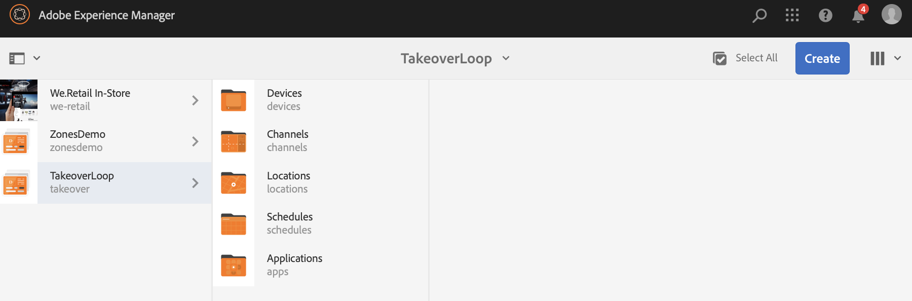
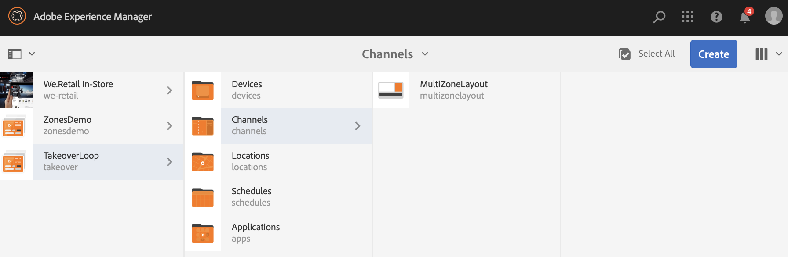

# Multi Zone to Single Zone Takeover Loop{#single-zoneto-multizone}

## Use Case Description {#use-case-description}

This section describes a use case example that emphasizes on how to set up a multi zone layout channel that alternates with a single zone layout channel. Each channel has sequencing image/video assets.

### Preconditions {#preconditions}

Before you start this use case, make sure you understand how to:

* **[Create and Manage Channels](/help/screens/managing-channels.md)**
* **[Create and Manage Locations](/help/screens/managing-locations.md)**
* **[Create and Manage Schedules](/help/screens/managing-schedules.md)**
* **[Device Registration](/help/screens/device-registration.md)**

### Primary Actors {#primary-actors}

Content Authors

## Setting up the Project {#setting-up-the-project}

Follow the steps below to set up a project:

1. Create an AEM Screens Project named as **TakeoverLoop**, as shown below.

   >[!NOTE]
   >
   >To learn more about creating and managing projects in AEM Screens, refer to [Creating a Project](/help/screens/creating-a-screens-project.md).

   

1. **Creating a Split Screen Channel**

    1. Select the **Channels** folder and click **Create** from the action bar to open the wizard to create a channel.
    1. Select **Left-L Bar Split Screen Channel** from the wizard and create the channel titled as **MultiZoneLayout**.

       

    1. Select the **MultiZoneLayout** channel and click **Edit** from the action bar to open the editor. Drag and drop the assets to each of the zones. The following example shows a video, image and a text banner in the channel, as shown below.
        

1. **Creating a 2X2 Channel with four images**

    1. Select the **Channels** folder and click **Create** from the action bar to open the wizard to create a channel.

    1. Select **2X2 Split Screen Channel** template from the wizard and create the channel titled as **TwobyTwoChannel**.

       
    1. Select the channel and click **Edit** from the action bar to open the editor and drag and drop four images (four different zones) to that channel, as shown below.
        

1. **Creating a 1X2 Split Screen Channel with two images**

    1. Select the **Channels** folder and click **Create** from the action bar to open the wizard to create a channel.

    1. Select **1X2 Split Screen Channel** template from the wizard and create the channel titled as **OnebyTwoChannel**.

       
    1. Select the channel and click **Edit** from the action bar to open the editor and drag and drop two images (two different zones) to that channel, as shown below.
        

1. **Creating a Channel with one full screen video**

    1. Select the **Channels** folder and click **Create** from the action bar to open the wizard to create a channel.

    1. Select **Sequence Channel** template from the wizard and create the channel titled as **FullScreensVideo**.

       
    1. Select the channel and click **Edit** from the action bar to open the editor and drag and drop the video component to that channel and then add the desired video, as shown below.
        