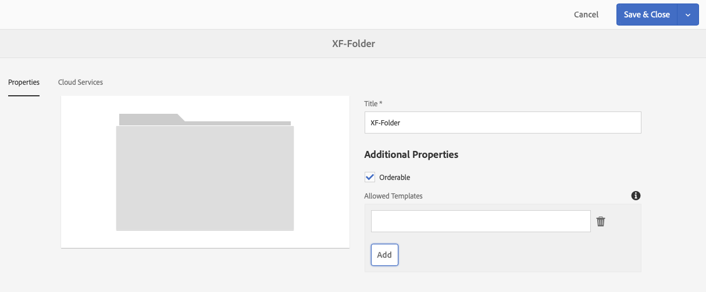

# Experience Fragments{#experience-fragments}

An Experience Fragment is a group of one or more components including content and layout that can be referenced within pages. They can contain any component.

An Experience Fragment:

* Is a part of an experience (page).
* Can be used across multiple pages.
* Is based on a template (editable only) to define structure and components.
* Is made up of one or more components, with layout, in a paragraph system.
* Can contain other experience fragments.
* Can be combined with other components (including other Experience Fragments) to form a complete page (experience).
* Can have different variations, which may share content and/or components.
* Can be broken down into building blocks that can be used across multiple variations of the fragment.

You can use Experience Fragments:

* If an author wants to re-use parts (a fragment of an experience) of a page, they need to copy and paste that fragment. Creating and maintaining these copy/paste experiences is time-consuming and prone to user errors. Experience Fragments eliminate the need for copy/paste.  
* To support the headless CMS use-case. Authors want to use AEM only for authoring but not for delivering to the customer. A third party system/touchpoint would consume that experience and then deliver to the end user.

>[!NOTE]
>
>Write access for experience fragments requires the user account to be registered in the group:
>
>`experience-fragments-editors`
>
>Please contact your system administrator if you are experiencing any issues.

## When Should You Use Experience Fragments? {#when-should-you-use-experience-fragments}

Experience Fragments should be used:

* Whenever you want to reuse experiences.

    * Experiences that will be reused with same or similar content

* When you use AEM as a content delivery platform for third parties.

    * Any solution that wants to use AEM as the content delivery platform
    * Embedding content in third party touchpoints

* If you have an Experience with different variations or renditions.

    * Channel or context-specific variations
    * Experiences that make sense to group (for example a campaign with different experiences across channels)

* When you use Omnichannel Commerce.

    * Sharing commerce-related content on social media channels at scale
    * Making touchpoints transactional

## Organizing your Experience Fragments {#organizing-your-experience-fragments}

It is recommended to:
* use folders to organize your Experience Fragments, 

* [configure the allowed templates on these folders](#configure-allowed-templates-folder).

Creating folders allows you to:

* create a meaningful structure for your Experience Fragments; for example, according to classification

  >[!NOTE]
  >
  >It is not necessary to align the structure of your Experience Fragments with the page structure of your site.

* [allocate the allowed templates at the folder level](#configure-allowed-templates-folder)

  >[!NOTE]
  >
  >You can use the [template editor](/help/sites-authoring/templates.md) to create your own template. 

The following example shows Experience Fragments structured according to `Contributors`. The structure used also illustrates how other features, such as Multi Site Management (including language copies), can be used. 

>[!CAUTION]
>
>The following screenshot was taken from the WKND site using Adobe Experience Manager as a Cloud Service.

   

## Creating and Configuring a Folder for your Experience Fragments {#creating-and-configuring-a-folder-for-your-experience-fragments}

To create and configure a folder for your Experience Fragments it is recommended to:

1. [Create a folder](/help/sites-authoring/managing-pages.md#creating-a-new-folder).

1. [Configure the allowed Experience Fragment templates for that folder](#configure-allowed-templates-folder).

>[!NOTE]
>
>It is also possible to configure the [Allowed Templates for your instance](#configure-allowed-templates-instance), but this method is **not** recommended as the values may be overwritten upon upgrade.

### Configure the Allowed Templates for your Folder {#configure-allowed-templates-folder}

>[!NOTE]
>
>This is the recommended method for specifying the **[!UICONTROL Allowed Templates]**, as the values will not be overwritten upon upgrade.

1. Navigate to the required **[!UICONTROL Experience Fragments]** folder.

1. Select the folder, and then **[!UICONTROL Properties]**.

1. Specify the regular expression for retrieving the required templates in the **[!UICONTROL Allowed Templates]** field.
   
   For example:
   `/conf/(.*)/settings/wcm/templates/experience-fragment(.*)?`
   
   

   >[!NOTE]
   >
   >See Templates for Experience Fragments for further details.
   <!--
   >See [Templates for Experience Fragments](/help/sites-developing/experience-fragments.md#templates-for-experience-fragments) for further details.
   -->

2. Select **[!UICONTROL Save and Close]**.

### Configure the Allowed Templates for your Instance {#configure-allowed-templates-instance}

>[!CAUTION]
>
>It is not recommended to change the **[!UICONTROL Allowed Templates]** by this method, as the templates specified may be overwritten upon upgrade.
>
>Please use this dialog for information purposes only.

1. Navigate to the required **[!UICONTROL Experience Fragments]** console.

1. Select **[!UICONTROL Configuration options]**:

   

1. Specify the required templates in the **[!UICONTROL Configure Experience Fragments]** dialog:

   

   >[!NOTE]
   >
   >See Templates for Experience Fragments for further details.
   <!--
   >See [Templates for Experience Fragments](/help/sites-developing/experience-fragments.md#templates-for-experience-fragments) for further details.
   -->

1. Select **[!UICONTROL Save]**.

## Creating an Experience Fragment {#creating-an-experience-fragment}

To create an Experience Fragment:

1. Select **[!UICONTROL Experience Fragments]** from the Global Navigation.

   

1. Navigate to the required folder and select **[!UICONTROL Create]**.

1. Select **[!UICONTROL Experience Fragment]** to open the **[!UICONTROL Create Experience Fragment]** wizard.

   Select the required **[!UICONTROL Template]**, then **[!UICONTROL Next]**:

   

2. Enter the **[!UICONTROL Properties]** for your Experience Fragment.

   A **[!UICONTROL Title]** is mandatory. If the **[!UICONTROL Name]** is left blank it will be derived from the **[!UICONTROL Title]**.

   

3. Click **[!UICONTROL Create]**.

   A message will be displayed. Select:

    * **[!UICONTROL Done]** to return to the console 
    * **[!UICONTROL Open]** to open the fragment editor

## Editing your Experience Fragment {#editing-your-experience-fragment}

The Experience Fragment Editor offers you similar capabilities to the normal page Editor. See [Editing Page Content](/help/sites-authoring/editing-content.md) for more information on how to use it.

The following example procedure illustrates how to create a teaser for a product:

1. Drag and drop a **[!UICONTROL Category Teaser]** from the [Components Browser](/help/sites-authoring/author-environment-tools.md#components-browser).

   

1. Select **[!UICONTROL Configure](/help/sites-authoring/editing-content.md#edit-configure-copy-cut-delete-paste)** from the component toolbar.
1. Add the **[!UICONTROL Asset]** and define the **[!UICONTROL Properties]** as required.
1. Confirm the definitions with **[!UICONTROL Done]** (tick icon).
1. Add more components as required.

## Creating An Experience Fragment Variation {#creating-an-experience-fragment-variation}

You can create variations of your Experience Fragment, depending on your needs:

1. Open your fragment for [editing](/help/sites-authoring/experience-fragments.md#editing-your-experience-fragment).
1. Open the **[!UICONTROL Variations]** tab.

   

1. **Create** allows you to create:

    * **[!UICONTROL Variation]**
    * **[!UICONTROL Variation as live-copy]**.

1. Define the required properties:

    * **[!UICONTROL Template]**
    * **[!UICONTROL Title]**
    * **[!UICONTROL Name]**; if left blank it will be derived from the Title
    * **[!UICONTROL Description]**
    * **[!UICONTROL Variation tags]**

   

1. Confirm with **[!UICONTROL Done]** (tick icon), the new variation will be shown in the panel:

   

## Using your Experience Fragment {#using-your-experience-fragment}

You can now use your Experience Fragment when authoring your pages:

1. Open any page for editing.

   For example: [http://localhost:4502/editor.html/content/we-retail/language-masters/en/products/men.html](http://localhost:4502/editor.html/content/we-retail/language-masters/en/products/men.html)

1. Create an instance of the Experience Fragment component, by dragging the component from the Components browser to the page paragraph system:

   

1. Add the actual Experience Fragment to the component instance; either:

    * Drag the required fragment from the Assets Browser and drop onto the component 
    * Select **[!UICONTROL Configure]** from the component toolbar and specify the fragment to use, confirm with **Done** (tick)

   

   >[!NOTE]
   >
   >Edit, in the component toolbar, operates as a shortcut to open the fragment in the fragment editor.

## Building Blocks {#building-blocks}

You can select one or more components to create a building block for recycling within your fragment:

### Creating a Building Block {#creating-a-building-block}

To create a new Building Block:

1. In the Experience Fragment editor, select the components you want to re-use:

   

1. From the components toolbar, select **[!UICONTROL Convert to building block]**:

   

   For example:

   

1. Enter the name of the **[!UICONTROL Building Block]**, and confirm with **[!UICONTROL Convert]**:

   

1. The **Building Block** will be shown in the tab, and can be selected in the paragraph system:

   

### Managing a Building Block {#managing-a-building-block}

Your building block is visible in the **[!UICONTROL Building Blocks]** tab. For each block, the following actions are available:

* Go to master: open the master variation in a new tab  
* Rename   
* Delete

 

### Using a Building Block {#using-a-building-block}

You can drag your building block to the paragraph system of any fragment, as with any component.

## The Plain HTML Rendition {#the-plain-html-rendition}

Using the `.plain.` selector in the URL, you can access the plain HTML rendition.

This is available from the browser, but its primary purpose is to allow other applications (for example, third party web apps, custom mobile implementations) to access the content of the Experience Fragment directly, using only the URL.

The plain HTML rendition adds the protocol, host and context path to paths that are:

* of the type: `src`, `href`, or `action`

* or end with: `-src`, or `-href`

For example:

`.../brooklyn-coat/master.plain.html`

>[!NOTE]
>
>Links always reference the publish instance. They are intended to be consumed by third parties, so the link will always be called from the publish instance, not the author.

 

## Exporting Experience Fragments {#exporting-experience-fragments}

By default, Experience Fragments are delivered in the HTML format. This can be used by both AEM and third party channels alike.

For export to Adobe Target, HTML is used. See [Target Integration with Experience Fragments](/help/sites-administering/experience-fragments-target.md) for full information.  

