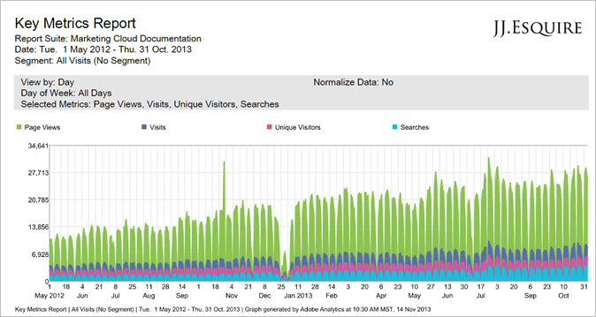

# Concept DITA Topic

The <concept> element is the top-level element for a topic that answers the question "what is?" Concepts provide background information that users must know before they can successfully work with a product or interface.

Internal Wiki page about Concepts and Getting Started topics [here](https://wiki.corp.adobe.com/display/techpubs/Concepts+and+Getting+Started+Topics).

* [Showing Character Elements](concept-topic.md#section_89F4BC1B22EF491AB3CD3D0C597DAFD1)
* [Paragraph, List, and Heading Elements](concept-topic.md#section_8F95FA67E8A94723BC0967FDCFA7997D)
* [Note Types](concept-topic.md#section_FBAC1698568B4E58B68F0E1EF2CE8D60)
* [Tables](concept-topic.md#section_A5C0A9AA844E4E70942000746890084B)

---

## Showing Character Elements

This is a `<codephrase> character element` (used for inline code snippets).

Here is an <!-- APINAME - Required Post Migration Cleanup -->`<apiname> character element` embedded in &lt;p&gt;.

Here is a <p> with **<bold>**, and *<italics>*, and a *`<term>`* (same style as italics), and `<cmdname>` (specifies the name of a command when it is part of a software discussion), and `foreign`.

Use [!DNL <filepath> character element] embedded in &lt;para&gt; for URLs and file names, file extensions.

Solution names like [!DNL Analytics] use &lt;keyword&gt;, but no special formatting. Tells localization vendor to leave in English.

Software element names like [!UICONTROL Pages Report] use &lt;wintitle&gt;, but no special formatting. Tells localization vendor that the term is a page name or group of UI elements used in the UI.

This is a *[!DNL varname]* element.

This is **[!UICONTROL uicontrol]** and **[!UICONTROL uicontrol]** without the menucascade element.

**[!UICONTROL uicontrol]** > **[!UICONTROL uicontrol]** in menucascade.

`This is a <screen> element that we never use.`

Symbols: ® © ¡ ¿ ¢ £ ¤ ¥ ¶ § ™ ª º ¹ ² ³ ¼ ½ ¾ ¦ €

[!DNL paramname]

---

## Paragraph, List, and Heading Elements

The following line contains an &lt;object&gt; element, which we use to [embed video](https://wiki.corp.adobe.com/display/techpubs/Embedding+videos). Note that we populate the object with attributes "data" and "type".

### Video Title

>[!VIDEO](https://www.youtube.com/watch?v=lDQ4Sm0FRtA)

*Video Description*

**Author's Name**
[http://authors.website.com/](http://authors.website.com/)

The following two "outputclass" lines let us apply a head attribute inside a &lt;p&gt; or a bold para, to give us a heading slightly larger than a regular or bold para. 

<p class="head">Outputclass Head </p>

<p class="head"><strong>Outputclass Head Bold</strong> </p>

**[!UICONTROL Menu]** > **[!UICONTROL Cascade]**

1. Ordered List
1. Ordered List 

   &lt;p&gt; embedded in the list. 

1. Ordered List

    1. level two embedded &lt;ol&gt;    
    1. level two embedded &lt;ol&gt;

        1. level three embedded        
        1. level three embedded

            1. level four embedded            
            1. level four embedded

* Unordered List bullet
* Bullet
* Bullet

    * level two unordered list    
    * level two    
    * level two

        * level three        
        * level three        
        * level three

            * level four            
            * level four

The following is an example of &lt;codeblock&gt;:

```
<codeblock> element. The <codeblock> element represents lines of program code. Example: 
 
//initialize AppMeasurement 
var s_account="INSERT-RSID-HERE" 
var s=s_gi(s_account) 
 
/******** VISITOR ID SERVICE CONFIG - REQUIRES VisitorAPI.js ********/ 
s.visitor=Visitor.getInstance("INSERT-MCORG-ID-HERE") 
 
/************************** CONFIG SECTION **************************/ 
/* You may add or alter any code config here. */ 
/* Link Tracking Config */ 
s.trackDownloadLinks=true 
s.trackExternalLinks=true 
s.trackInlineStats=true 
s.linkDownloadFileTypes="exe,zip,wav,mp3,mov,mpg,avi,wmv,pdf,doc,docx,xls,xlsx,ppt,pptx" 
s.linkInternalFilters="javascript:" //optional: add your internal domain here 
s.linkLeaveQueryString=false 
s.linkTrackVars="None" 
s.linkTrackEvents="None"
```

---

## Note Types

Here are available &lt;note&gt; elements. We primarily use "note" and "important" attributes. We should consider applying styles to the "warning", "caution", and "remember."

>[!NOTE] {grayBox="false"}
>
><p>&lt;note&gt; embedded in &lt;para&gt;. Not sure there&#39;s much of a difference if a note is embedded in a &lt;p&gt;.</p> 

>[!NOTE] {grayBox="false"}
>
>&lt;note&gt; not embedded in &lt;para&gt;. 

>[!CAUTION] {grayBox="false"}
>
>Note with "important" attribute type. 

>[!NOTE] {grayBox="false"}
>
>Note with "warning" attribute type. 

>[!NOTE] {grayBox="false"}
>
>Note with "attention" attribute type. 

>[!NOTE] {grayBox="false"}
>
>Note with "remember" attribute type. We never use this, but here it is.

The following is an &lt;image&gt; element. This element is **always** embedded in a &lt;p&gt; element. Process graphics and some screen shots are used in Concepts. Most screens are in Task topics (in the &lt;stepresult&gt; element following a &lt;cmd&gt;.

[ ](task-dita-topic.md) 

---

## Tables

**Documentation Updates Table** 

<table id="table_054991DC9D954F8495884062C4C73C62"> 
 <thead> 
  <tr> 
   <th class="entry" colname="col1"> Date </th> 
   <th class="entry" colname="col2"> Description </th> 
  </tr> 
 </thead> 
 <tbody> 
  <tr> 
   <td colname="col1"> <p>February 24 2016 </p> </td> 
   <td colname="col2"> <p>Added content. </p> </td> 
  </tr> 
  <tr> 
   <td colname="col1"> <p>25 January 2016 </p> </td> 
   <td colname="col2"> <p>Added content. </p> </td> 
  </tr> 
  <tr> 
   <td colname="col1"> <p>23 September 2015 </p> </td> 
   <td colname="col2"> <p> </p> </td> 
  </tr> 
 </tbody> 
</table>

**Table Cells without Para Elements** 

|  Element  | Description  |
|---|---|
|  Element Name  | System requirements and a comparison of Analysis Workspace, Reports & Analytics, Ad Hoc Analysis, Report Builder, and Data Workbench  |
|  Element Name  | System requirements and a comparison of Analysis Workspace, Reports & Analytics, Ad Hoc Analysis, Report Builder, and Data Workbench  |
|  Element Name  | System requirements and a comparison of Analysis Workspace, Reports & Analytics, Ad Hoc Analysis, Report Builder, and Data Workbench  |

<p class="head"><strong>Product Requirements Outputclass Head</strong> </p>

<table id="table_8A42BE3253024552A170F6471B1E4D1D"> 
 <tbody> 
  <tr> 
   <td> <strong>Product Name &amp; Help Link</strong> </td> 
   <td> <a format="https" href="https://marketing.adobe.com/resources/help/en_US/analytics/analysis-workspace/" scope="external"> Analysis Workspace </a> </td> 
   <td> <a format="https" href="https://marketing.adobe.com/resources/help/en_US/sc/user/index.html" scope="external"> Reports &amp; Analytics </a> </td> 
   <td> <a format="https" href="https://marketing.adobe.com/resources/help/en_US/dsc/" scope="external"> Ad Hoc Analysis </a> </td> 
   <td> <a format="https" href="https://marketing.adobe.com/resources/help/en_US/arb/index.html" scope="external"> Report Builder </a> </td> 
   <td colname="col06"> <a format="https" href="https://marketing.adobe.com/resources/help/en_US/reference/?f=data_warehouse" scope="external"> Data Warehouse </a> </td> 
   <td colname="col6"> <a format="https" href="https://marketing.adobe.com/resources/help/en_US/insight/" scope="external"> Data Workbench </a> </td> 
  </tr> 
  <tr> 
   <td> <strong>Access Method</strong> </td> 
   <td> Browser solution for building robust, custom analysis projects, and democratizing insights. </td> 
   <td> Browser solution for digital analysis. </td> 
   <td> Java based tool for advanced digital analysis. </td> 
   <td> Excel add-in that lets you build customized requests from R&amp;A data, and visualize using Microsoft Excel. </td> 
   <td colname="col06"> Browser solution that generates reports in <span class="keyword filepath"> .csv </span> format. Can generate Tableau format files. </td> 
   <td colname="col6"> Multi-channel analytics tool for advanced analysis, such as custom attribution modeling, predictive analytics, and 360 customer analysis. </td> 
  </tr> 
  <tr> 
   <td> <strong>Report Breakdowns</strong> </td> 
   <td> Unlimited </td> 
   <td> Up to 2 correlations </td> 
   <td> Unlimited </td> 
   <td> Up to 2 correlations </td> 
   <td colname="col06"> <p> Performs fully expanded, unlimited breakdowns, break down by segment. </p> </td> 
   <td colname="col6"> Unlimited </td> 
  </tr> 
  <tr> 
   <td> <strong>Segment Comparisons</strong> </td> 
   <td> Unlimited </td> 
   <td> Up to 2 segments </td> 
   <td> Unlimited </td> 
   <td> Unlimited (data request stacking) </td> 
   <td colname="col06"> <p>1 segment </p> <p> Supports multiple (stacked) segments. </p> </td> 
   <td colname="col6"> Unlimited </td> 
  </tr> 
  <tr> 
   <td> <strong>Row Output Limit</strong> </td> 
   <td> 200 </td> 
   <td> 200 </td> 
   <td> 50,000 </td> 
   <td> 50,000 </td> 
   <td colname="col06"> Unlimited </td> 
   <td colname="col6"> Customizable </td> 
  </tr> 
  <tr> 
   <td> <strong>Unique Value Limits (within eVar/ prop reports)</strong> </td> 
   <td> 500K-2MM </td> 
   <td> 500K-2MM </td> 
   <td> 500K-2MM </td> 
   <td> 500K-2MM </td> 
   <td colname="col06"> Unlimited </td> 
   <td colname="col6"> Customizable </td> 
  </tr> 
  <tr> 
   <td> <strong>Funnel/Pathing</strong> </td> 
   <td> Planned </td> 
   <td> <a format="https" href="https://marketing.adobe.com/resources/help/en_US/sc/user/?f=reports" scope="external"> Yes </a> </td> 
   <td> <a format="https" href="https://marketing.adobe.com/resources/help/en_US/dsc/?f=c_reports_paths" scope="external"> Yes </a> </td> 
   <td> Yes </td> 
   <td colname="col06"> No </td> 
   <td colname="col6"> Yes </td> 
  </tr> 
  <tr> 
   <td> <strong>Advanced Customer Journey Analysis</strong> </td> 
   <td> Planned </td> 
   <td> No </td> 
   <td> Yes </td> 
   <td> No </td> 
   <td colname="col06"> No </td> 
   <td colname="col6"> Yes </td> 
  </tr> 
  <tr> 
   <td> <strong>Cohort Analysis</strong> </td> 
   <td> <a format="https" href="https://marketing.adobe.com/resources/help/en_US/analytics/analysis-workspace/?f=cohort_analysis" scope="external"> Yes </a> </td> 
   <td> No </td> 
   <td> No </td> 
   <td> No </td> 
   <td colname="col06"> No </td> 
   <td colname="col6"> Yes </td> 
  </tr> 
  <tr> 
   <td> <strong>Advanced Attribution</strong> </td> 
   <td> Limited currently - first/last/linear </td> 
   <td> Limited - first/last/linear </td> 
   <td> Limited - first/last/linear </td> 
   <td> Limited - first/last/linear </td> 
   <td colname="col06"> Limited - first/last/linear </td> 
   <td colname="col6"> Yes </td> 
  </tr> 
  <tr> 
   <td> <strong>Enhanced Visualization Options</strong> </td> 
   <td> <a format="https" href="https://marketing.adobe.com/resources/help/en_US/analytics/analysis-workspace/?f=analysis-workspace-features" scope="external"> Yes </a> </td> 
   <td> No </td> 
   <td> Yes </td> 
   <td> Yes </td> 
   <td colname="col06"> No </td> 
   <td colname="col6"> Yes </td> 
  </tr> 
  <tr> 
   <td> <strong>Customizable Layout</strong> </td> 
   <td> <a format="https" href="https://marketing.adobe.com/resources/help/en_US/analytics/analysis-workspace/?f=analysis-workspace-features" scope="external"> Yes </a> </td> 
   <td> Yes - <a format="https" href="https://marketing.adobe.com/resources/help/en_US/sc/user/?f=dashboard" scope="external"> Dashboards </a> </td> 
   <td> No </td> 
   <td> <a format="https" href="https://marketing.adobe.com/resources/help/en_US/arb/?f=configure_the_custom_layout" scope="external"> Yes </a> </td> 
   <td colname="col06"> <p> Sort results by breakdown or by metrics. </p> </td> 
   <td colname="col6"> Yes </td> 
  </tr> 
  <tr> 
   <td> <strong>Project Curation (Simplify reports for non-analysts)</strong> </td> 
   <td> <a format="https" href="https://marketing.adobe.com/resources/help/en_US/analytics/analysis-workspace/?f=curate" scope="external"> Yes </a> </td> 
   <td> No </td> 
   <td> No </td> 
   <td> Yes </td> 
   <td colname="col06"> No </td> 
   <td colname="col6"> Yes </td> 
  </tr> 
  <tr> 
   <td> <strong>Project Sharing</strong> </td> 
   <td> <a format="https" href="https://marketing.adobe.com/resources/help/en_US/analytics/analysis-workspace/?f=curate" scope="external"> Yes </a>; all/any users </td> 
   <td> <a format="https" href="https://marketing.adobe.com/resources/help/en_US/sc/user/?f=scheduling" scope="external"> Yes </a>; all/any users </td> 
   <td> Only with Ad Hoc Analysis users </td> 
   <td> Yes; all/any users </td> 
   <td colname="col06"> No </td> 
   <td colname="col6"> Yes </td> 
  </tr> 
  <tr> 
   <td> <strong>Scheduled Report Delivery</strong> </td> 
   <td> Planned for Spring release 2016 </td> 
   <td> <a format="https" href="https://marketing.adobe.com/resources/help/en_US/sc/user/?f=scheduling" scope="external"> Yes </a> </td> 
   <td> <a format="https" href="https://marketing.adobe.com/resources/help/en_US/dsc/?f=c_schedule" scope="external"> Yes </a> </td> 
   <td> <a format="https" href="https://marketing.adobe.com/resources/help/en_US/arb/?f=schedule_report_requests" scope="external"> Yes </a> </td> 
   <td colname="col06"> Yes </td> 
   <td colname="col6"> Yes </td> 
  </tr> 
  <tr> 
   <td> <strong>System Requirements</strong> </td> 
   <td> <p>Browser </p> <p> <a format="https" href="https://marketing.adobe.com/resources/help/en_US/sc/user/?f=requirements" scope="external"> More... </a> </p> </td> 
   <td> <p>Browser </p> <p> <a format="https" href="https://marketing.adobe.com/resources/help/en_US/sc/user/?f=requirements" scope="external"> More... </a> </p> </td> 
   <td> <p>Java </p> <p> <a format="http" href="http://marketing.adobe.com/resources/help/en_US/dsc/index.html?f=c_sys_reqs" scope="external"> More... </a> </p> </td> 
   <td> <p>Windows, MS Excel </p> <p> <a format="http" href="http://marketing.adobe.com/resources/help/en_US/arb/index.html?f=system_requirements" scope="external"> More... </a> </p> </td> 
   <td colname="col06"> Browser and program to open <span class="keyword filepath"> .csv </span> files like MS Excel. Can generate Tableau format files. </td> 
   <td colname="col6"> Windows 64 bit, good graphics adapter for OpenGL 3.2 ( <u> <a format="https" href="https://marketing.adobe.com/resources/help/en_US/insight/install/c_Data_Workbench_Client_install.html" scope="external"> More... </a></u> ) </td> 
  </tr> 
 </tbody> 
</table>

Para between tables

|  Unformatted table.  | Usually used on home pages.  |
|---|---|
|  table  | table  |
|  table  | table  |
|  table  | table  |

|  Element  | Description  |
|---|---|
|  Element Name  | System requirements and a comparison of Analysis Workspace, Reports & Analytics, Ad Hoc Analysis, Report Builder, and Data Workbench  |
|  Element Name  | System requirements and a comparison of Analysis Workspace, Reports & Analytics, Ad Hoc Analysis, Report Builder, and Data Workbench  |
|  Element Name  | System requirements and a comparison of Analysis Workspace, Reports & Analytics, Ad Hoc Analysis, Report Builder, and Data Workbench  |

---

## Section After Table

We often see a formatting problem with headings after a table. Jacob fixed it. 

>[!MORE_LIKE_THIS]
>
>* [Composite DITA Topic for Unified Help](composite-dita-topic.md#topic_298651E53E82415B9A8AD7B2F3E6927A)
>* [Task DITA Topic for Unified Help](t_task-dita-topic.md#task_5103974C88264AAEB37A79E6BC8B0199)
