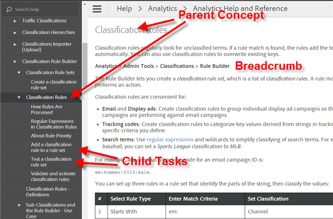
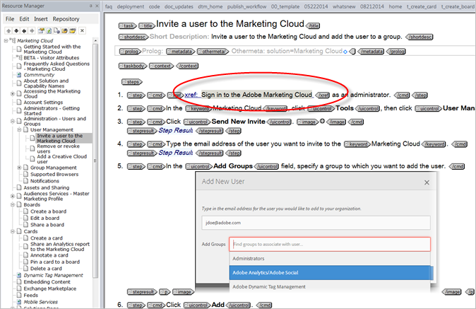
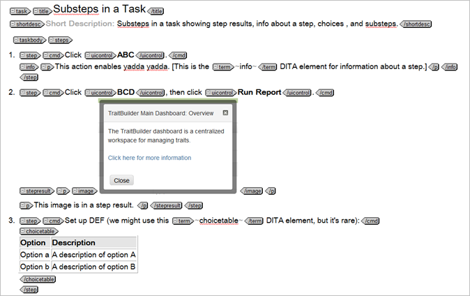
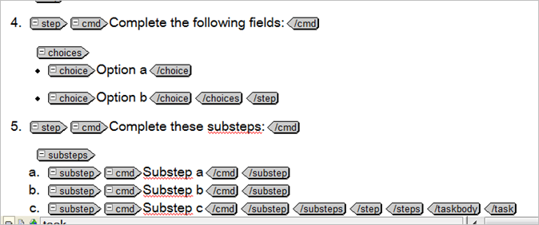
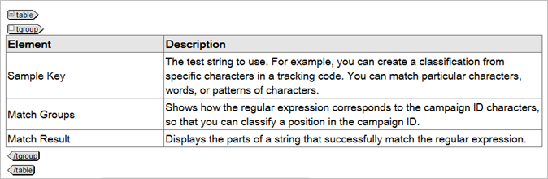
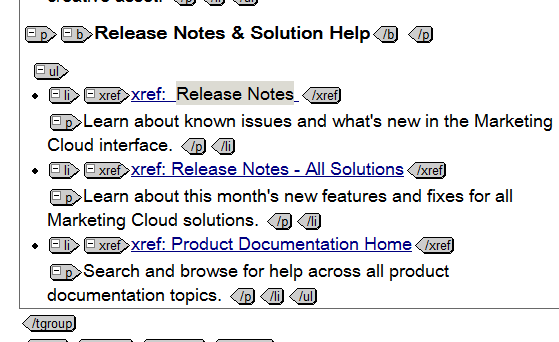

# Writers - Documentation Style Guide for DITA XML Authors

Guidelines and standards for authoring in DITA XML.

Following these guidelines ensures a consistent look across Marketing Cloud help. These guidelines don't necessarily define the only way to author in DITA XML--you can implement some variation depending on your product needs. Where possible, try to be consistent.

Last update: 4/29/2014

* [Content Type](xmetal-style.md#section_AED08C83542A45978361E4501A0C0F6D)
* [TOC Structure](xmetal-style.md#section_BE95FE1538314AAABB005C589BB968A1)
* [Tasks](xmetal-style.md#section_A8A3CCCE473B428DA2E0C4973CA616D5)
* [Substeps](xmetal-style.md#section_C03FECBA4C104C9F877908D1F0E2B08A)
* [Body Elements](xmetal-style.md#section_91BFDE70794840B0B40A2ACC750CB24A)
* [Tables and Field Descriptions](xmetal-style.md#section_0D0F4EDB8E7B48B1B8B75DC736F55394)
* [Screenshots and Graphics](xmetal-style.md#section_1BA5D2FF918A48C1868537B7FE9E53A3)
* [Lists](xmetal-style.md#section_BB363D07A9DD4BFB99E31D285A501047)
* [Capitalization](xmetal-style.md#section_F6EAD7F391A24C1E8769AEFB849B55FF)
* [Quickstarts or Getting Started Pages](xmetal-style.md#section_99E6852F0FED4968BBDE905157BD8593)
* [Release Notes](xmetal-style.md#section_DCAF08E9AA5146D3ABA9697E434304D5)
* [What's New Page](xmetal-style.md#section_7248943F84194FA99F68C9213E6FBEE3)
* [Cross References](xmetal-style.md#section_0A21DDDC888C4D73987533D58C624DE4)
* [File Names](xmetal-style.md#section_649F8AB63EE94AA3B35F27DB0AC5B891)

>[!NOTE] {grayBox="false"}
>
>If you're using <dfn class="term">conrefs</dfn> and other advanced elements that make life easier, feel free to send me some info on how you're using it, and I'll add it here.

---

## Content Type

DITA XML provides the structure we need to design information consistently. Adhere to XMetaL's rules on structuring elements and file (container) types. When you need to create a new topic, it should be one of these three: 

<table id="table_83A38F4353DE4FA38C157F57DC7541D1"> 
 <thead> 
  <tr> 
   <th class="entry" colname="col1">Content Type </th> 
   <th class="entry" colname="col2">Usage </th> 
  </tr> 
 </thead> 
 <tbody> 
  <tr> 
   <td colname="col1"> 
Concept 
 </td> 
   <td colname="col2"> 
The &amp;lt;concept &amp;gt; element is the top-level element for a topic that answers the question "what is?" and "why?" Concepts provide background information that users must know before they can successfully work with a product or interface. Often, a concept is an extended definition of a major abstraction such as a process or function. It might also have an example or a graphic, but generally the structure of a concept is fairly simple. 
 
<strong>Special Use for Field Descriptions</strong> 
 
Context sensitive help often links to the parent concept. Often, readers are looking for definitions of fields in this circumstance. Where appropriate, place field description tables in the concept, under a heading that matches the interface page name. 
 
A concept that includes a procedure should have a separate child Task type that includes only step information. (What to click to accomplish at ask.) 
 </td> 
  </tr> 
  <tr> 
   <td colname="col1"> 
Task 
 </td> 
   <td colname="col2"> 
Task topics answer "How do I?" questions, and have a well-defined structure that describes how to complete a procedure to accomplish a specific goal. Use the task topic to describe the steps of a particular task, or to provide an overview of a higher-level task. The task topic includes sections for describing the context, prerequisites, actual steps, expected results, example, and expected next steps for a task. 
 
If you have conceptual information for a task, create a parent Concept topic. 
 </td> 
  </tr> 
  <tr> 
   <td colname="col1"> 
Reference 
 </td> 
   <td colname="col2"> 
 Reference topics document programming constructs or facts about a product. Examples of reference topics include (but are not limited to) product specifications, environmental specifications, equipment lists, parts lists, required tools, language elements, class descriptions, commands, functions, and API information. 
 </td> 
  </tr> 
 </tbody> 
</table>

---

## TOC Structure

Best practices for structuring the TOC, naming concepts and tasks.

* **Parent Concept:** Use headline capitalization, no verbs. Match the UI page name, where possible.
* **Child Tasks:** Use sentence capitalization.
* **Breadcrumb:** Optional. Useful for helping a user quickly find a page, without forcing them to locate or read a task. Breadcrumbs are, in most cases, the only task-type information allowed in a concept.
* Consider alphabetizing the main entries in your TOC, rather than mirroring the layout of the UI. [Example](http://microsite.omniture.com/t2/help/en_US/reference/admin.html). The help system should focus on quickly finding information.

---

## Tasks

In the Task topic, include only information relevant to accomplishing the task. If you find yourself adding conceptual information, you need a Concept parent topic.

In a task, limit the information to navigation, screens, and what to click to succeed in the procedure. Consider defining your field/options in a table in the parent concept, not in the task. Users typically look at tasks so that they can quickly locate where to go or what to click.

**Sample Task**

 

---

## Substeps

 

To see output, go to [Substeps in a Task](task_substeps.md#task_8D486750F3B645DDA16197CE5C855B82).

---

## Body Elements

Elements identify or formats words and paragraphs, to identify them as products, variables, keywords, field descriptions, and so on. The following table defines frequently used elements in Marketing Cloud documentation: 

<table id="table_2C289461F73E4361BB55055E0E449A78"> 
 <thead> 
  <tr> 
   <th class="entry" colname="col1">Element Name </th> 
   <th class="entry" colname="col2">Description </th> 
  </tr> 
 </thead> 
 <tbody> 
  <tr> 
   <td colname="col1">keyword </td> 
   <td colname="col2"> 
Identifies formal solution or product names, such as Analytics, Social, Target, Media Optimizer, Experience Manager, and Marketing Cloud. Example: 
 
 
 
<strong>Purpose</strong>: Enables vendors know that the word should remain in English. No change to formatting. 
 
 
Note:  Capability names are not wrapped or capitalized. 
 
 </td> 
  </tr> 
  <tr> 
   <td colname="col1">wintitle </td> 
   <td colname="col2"> 
Identifies interface elements, like windows or dialogs, or other user interface elements at the same level of grouping. Includes page names, report names, wizard titles, wizard page titles, and window pane titles. Example: 
 
 
 
Use instead of uicontrol inline. 
 
 <strong>Examples</strong>: ASI Slots, Code Manager, Segment Builder, Fallout Report. (Include report where appropriate). 
 
<strong>Purpose</strong>: So that localization can identify a formal UI term. No change to formatting. 
 
Do not use for metric names. 
 </td> 
  </tr> 
  <tr> 
   <td colname="col1">uicontrol </td> 
   <td colname="col2"> 
Use around interface controls (fields, options) primarily in procedures, where user action is required. Changes output to <strong>bold</strong>. 
 
Example: 
 
    <ol id="ol_B711EA96F1AC4496AB44D655EB6B3CD2"> 
     <li id="li_95D38154A7BC49E1A5536B51B9F2E88A">Click Upload, then click Save. </li> 
    </ol> 
Note:  Menucascade is preferable for navigation breadcrumbs. 
 </td> 
  </tr> 
  <tr> 
   <td colname="col1">menucascade &amp;gt; abc </td> 
   <td colname="col2"> 
Use for navigation breadcrumbs. 
 
 
 </td> 
  </tr> 
  <tr> 
   <td colname="col1">varname </td> 
   <td colname="col2">For analytics variables. (Output is italic.) </td> 
  </tr> 
  <tr> 
   <td colname="col1">codeblock </td> 
   <td colname="col2"> 
    <codeblock>
      For code on a separate line. 
    </codeblock> </td> 
  </tr> 
  <tr> 
   <td colname="col1">codeph </td> 
   <td colname="col2">Inline code. Use when the code should remain in the paragraph. </td> 
  </tr> 
  <tr> 
   <td colname="col1">draft-comment </td> 
   <td colname="col2">Hides text from output. Useful to remind yourself about needed work in a topic. </td> 
  </tr> 
  <tr> 
   <td colname="col1">filepath </td> 
   <td colname="col2"> 
Used for URLs and file names, including: 
 
    <ul id="ul_742BBEFBD1E24F0A852070FB7B1FFCC7"> 
     <li id="li_E1611C675FE54089AF71664E8C0E062B">File types, such as code.js and filename.pdf </li> 
     <li id="li_4BB05011D2904E3E96F9C756E92E01F8">URLs, such as marketing.adobe.com </li> 
     <li id="li_C6683B9C91C14E0B8D0B11654A5612CD">Explorer paths, such as c:\programs\install </li> 
    </ul> </td> 
  </tr> 
  <tr> 
   <td colname="col1">image </td> 
   <td colname="col2"> 
Insert an image only when the image provides relevant, useful information. 
 
Best practices: 
 
    <ul id="ul_DCCD356FC0EA4ACD86ADE0B96A311E08"> 
     <li id="li_A5E53EACFF9C4EB1B92305CEC1244DFB">Always embed (wrap) image in a p. </li> 
     <li id="li_4296CF1FB575457FADD09459D32E39B1">For images in steps, wrap them in step result or info element after command (cmd). </li> 
    </ul> 
Example structure: 
 
 
 </td> 
  </tr> 
  <tr> 
   <td colname="col1">note </td> 
   <td colname="col2"> 
Adds a formatted Note element. 
 
Note:  Note example 
 </td> 
  </tr> 
  <tr> 
   <td colname="col1">term </td> 
   <td colname="col2"> 
Italics for a term. 
 </td> 
  </tr> 
  <tr> 
   <td colname="col1">ul, ol </td> 
   <td colname="col2"> 
ul for bullets. No need to add para around or in lists. 
 
    <ul id="ul_D71FFCA4FF3F499281E9A06F1A8A6AD7"> 
     <li id="li_2C84B795D290429BB26EF653E72FC5C2">UL </li> 
     <li id="li_EDE6B5FCB4934E329CD8D74C5A216F59">UL </li> 
    </ul> 
ol for numbered lists outside of the Task topic type. 
 
    <ol id="ol_B47CFC999E5E433D98ED989D38F8729B"> 
     <li id="li_3EF28505CB0B4EF6AC972F18B4E5EC58">OL </li> 
     <li id="li_C281E686B05A441A8D58C7C21E348EF4">OL </li> 
    </ol> </td> 
  </tr> 
  <tr> 
   <td colname="col1">xref </td> 
   <td colname="col2"> 
Use Insert &amp;gt; Link to access links. 
 
See <a format="dita" href="xmetal-style.md#section_0A21DDDC888C4D73987533D58C624DE4" scope="local">Cross References</a>. 
 </td> 
  </tr> 
  <tr> 
   <td colname="col1">F8 </td> 
   <td colname="col2"> 
Select text then press F8 to comment (hide) the text from output. 
 
 
 </td> 
  </tr> 
  <tr> 
   <td colname="col1">stepresult </td> 
   <td colname="col2"> 
Use after a step in a task, when you need to provide information that results from the action taken in the numbered step. Insert a p within stepresult. 
 </td> 
  </tr> 
  <tr> 
   <td colname="col1">info </td> 
   <td colname="col2"> 
User after a step in a task for information that is relevant to the step. Insert a p within info. 
 </td> 
  </tr> 
  <tr> 
   <td colname="col1">shortdesc </td> 
   <td colname="col2"> 
Use as an abstract that defines the topic or, in some cases, the topic name. It is the purpose or theme of the topic. Examples: 
 
<strong>For Concepts / Definitions</strong> 
 
<strong>Topic title:</strong> Custom Events Report 
 
Shortdesc: <i>The conversion actions on your site that you want visitors to complete. These actions might be a registration, a subscription, a lead form completion, a chat initiation, a purchase, a booking, or a finished survey.</i> 
 
<strong>For Tasks</strong> 
 
<strong>Task title:</strong> Run a Custom Events report 
 
 <i>Steps that describe how to run a Custom Events during implementation in ad hoc analysis.</i> 
 
Try to include useful information about the task, such as when or why the user must perform the task. In other words, avoid short descriptions that only repeat the task name. 
 </td> 
  </tr> 
 </tbody> 
</table>

---

## Tables and Field Descriptions

Example of a definitions page:

 

In XMetaL, click **[!UICONTROL Table]** > **[!UICONTROL Insert Table]**.

Enable **[!UICONTROL Insert Header]**.

No para tag is necessary for one paragraph in a cell. Necessary when two or more paras are present.

Table headings: *Element* and *Description.*

[Field Descriptions Example](http://microsite.omniture.com/t2/help/en_US/reference/classification_rule_definitions.html)

---

## Screenshots and Graphics

Insert the *`image`* element. They work best wrapped in *`p`* elements.

Capture settings:

* Create a lowercase *graphics* folder in your project for storage.
* If your image exceeds 672, reduce to that value.
* 1 pt gray border, if necessary.
* 10% fade on edge effects (right and bottom), where appropriate.

For process graphics, ensure that an Illustrator version exists. Send with the output when localizing.

[Cloud UI Icons](https://icons.corp.adobe.com/apps/athena/#/cloud-ui)

---

## Lists

* Keep parallel and use (or don't use) punctuation consistently.
* No need to wrap ul with a para tag.
* No need for para tags in li.

 

---

## Capitalization

Use standard sentence and heading styles. Capitalize metrics like fields when used as a proper noun. For example:

* The Page Views metric (proper noun, no element wrap needed).
* "The Page Views metric displays page views for the selected..."
* Capitalize interface items for clarity, even if the interface item is not capitalized (but should be). Example: Use "Click **[!UICONTROL Send to Email]**" even if the UI says **[!UICONTROL Send to email]**.

---

## Quickstarts or Getting Started Pages

Customers like to see a Getting Started topic for products.

[Example](http://microsite.omniture.com/t2/help/en_US/reference/)

---

## Release Notes

[Located here](http://microsite.omniture.com/t2/help/en_US/whatsnew/)

We need to get all products represented on the Release Notes page. The document provides a standard table for features, and a list of fixes

* Section name for each capability
* Table for new feature
* List for fixes
* Link to your guide's What's New page

---

## What's New Page

The What's New page is where you provide robust new feature information. Ideal to use as the draft doc in a beta.

* Use a parent Concept page with a URL that never changes.
* Use child pages for release versions. This is where

A cumulative list of release notes should go at the end of your help (to not be in the way up front when you build PDF).

---

## Cross References

<table id="table_8E8755F7C6D347F6A5020AC98DE5671E"> 
 <thead> 
  <tr> 
   <th class="entry" colname="col1">Item </th> 
   <th class="entry" colname="col2">Description </th> 
  </tr> 
 </thead> 
 <tbody> 
  <tr> 
   <td colname="col1">Cross reference </td> 
   <td colname="col2">Links to an internal xml file in your project. </td> 
  </tr> 
  <tr> 
   <td colname="col1">Weblink </td> 
   <td colname="col2"> 
Use the index.html?f=filename format so that localized URLs resolve. 
 </td> 
  </tr> 
  <tr> 
   <td colname="col1">Release Notes </td> 
   <td colname="col2">All xrefs in the <a format="http" href="http://microsite.omniture.com/t2/help/en_US/whatsnew/" scope="external">DMa release notes</a> need to be weblinks. </td> 
  </tr> 
 </tbody> 
</table>

---

## File Names

Please keep them lowercase, brief, and predictable. Pattern them after the UI page name, not the a task name (which inevitably changes frequently.

Prepend [!DNL t_] for task and [!DNL r_] before reference. No need for [!DNL c_] before concept.

Examples:

 