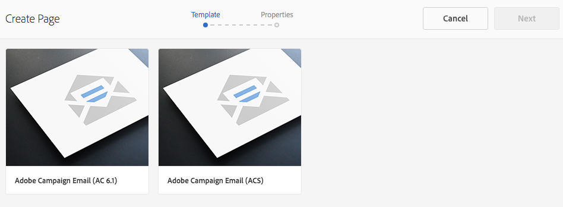

# Working with Tasks{#working-with-tasks}

Tasks represent items of work to be done on content. When you are assigned a task, it appears in your Workflow Inbox. Task items have a value of task in the Type column.

Tasks are also used in projects to determine the level of completeness of current tasks, including workflow tasks.

## Tracking Project Progress {#tracking-project-progress}

You can track project progress by looking at the active/completed tasks inside a project represented by the **Tasks** tile. Project progress can be determined by:

* **Task Tile:** An overall progress of the project is depicted in the Task Tile available on the project details page.  

* **Task List:** When clicking the Task tile, a list of tasks is displayed. This list has detailed information about all the tasks related to the project.

Both list workflow tasks as well as tasks you create directly in the **Tasks** tile. 

#### Task Tile {#task-tile}

If a project has any related tasks, a Task Tile is displayed inside the project. The Task Tile shows the current status of the project. This is based on existing tasks inside the workflow and does not include any tasks that will generated in future as the workflow proceeds. The following information is visible in the task tile:

* Percentage of completed tasks  
* Percentage of active tasks
* Percentage of overdue tasks

### Viewing or Modifying the Tasks in a Project {#viewing-or-modifying-the-tasks-in-a-project}

Besides tracking progress, you may also want to view more information about the project or modify it.

#### Task List {#task-list}

Click the ellipsis (...) in the Task tile to display the list of the tasks related to the project. The tasks are divided by parent workflows. The task details are displayed along with metadata such as due date, assignee, priority, and status.

#### Task Details {#task-details}

For more information on a particular task, in the Task List, tap/click the task and **Task Details **open.

### Viewing and Modifying Task Comments {#viewing-and-modifying-task-comments}

In Task details, you can edit or add comments. In addition all comments in a project are visible in the Comments area.

### Adding Tasks {#adding-tasks}

You can add new tasks to projects. These tasks then appear in the Tasks tile and are available in the Notifications inbox to perform actions on.

To add a task:

1. In the project, in the **Tasks** tile, tap/click the + icon. The **Add Task **window opens.
1. Enter information about the task. The title of the task and which group it is assigned to are mandatory. Additional information such as the content path, description, task priority, and due date are optional. In addition, you can select the **Advanced** tab to enter the name of the task, which is used to name the URL.

   

1. Tap/click **Create**.

## Working with Tasks in the Inbox {#working-with-tasks-in-the-inbox}

Another way to access tasks is from the Inbox. From the inbox, you can open the content to implement the required changes. When done, you set the task status to Completed. Tasks also appear in your inbox when they are assigned to a user group that you belong to. In this case, any member of the group can perform the work and complete the task.

The task status is also displayed on the Task Management page, where projects are managed. (See [Track Content Changes Using Task Management](../../administering/using/task-manager.md).)

To complete a task, select the task and click **Complete**. Add information to the task and then click **Done**. See [Your Inbox](../../authoring/using/inbox.md) for more information.

<!--
Comment Type: draft

<h3>Viewing or Modifying Your Tasks in the Inbox</h3>
-->

<!--
Comment Type: remark
Last Modified By: Alva Ware-Bevacqui (alvawb)
Last Modified Date: 2018-02-02T12:33:25.094-0500

Subsequent procedure/section is classic UI, I think. mark as draft for now. doesn't seem to have equivalent in touch ui.

-->

<!--
Comment Type: draft

The Inbox console lists the work items that are assigned to you or to a user group to which you belong. The columns of the list provide information about the workflow and the work item:

<ul>
<li><strong>Name</strong>: The name of the work item. This generic title typically indicates the type of work that is required of you. </li>
<li><strong>Status</strong>: Whether the task is active or inactive.</li>
<li><strong>Assign to:</strong> The user or group to whom the work item has been delegated.</li>
<li><strong>Content Path</strong>: The path of the page that requires work.</li>
<li><strong>Description</strong>: More information on the task.</li>
<li><strong>Task Priority</strong>: The priority level - low, medium, high.</li>
<li><strong>Workflow Title:</strong> The title of the workflow that the initiator of the workflow provided. Workflows can include no title. </li>
<li><strong>Current Assignee:</strong> </li>
<li><strong>Start Time:</strong> The time at which the work item was assigned.</li>
</ul>

The following procedure describe how to open the Inbox console.

-->

<!--
Comment Type: draft

<ol>
<li>
On the AEM home page, click Tools.
 </li>
<li>
In the Tasks area, click Inbox.
 </li>
</ol>
-->

